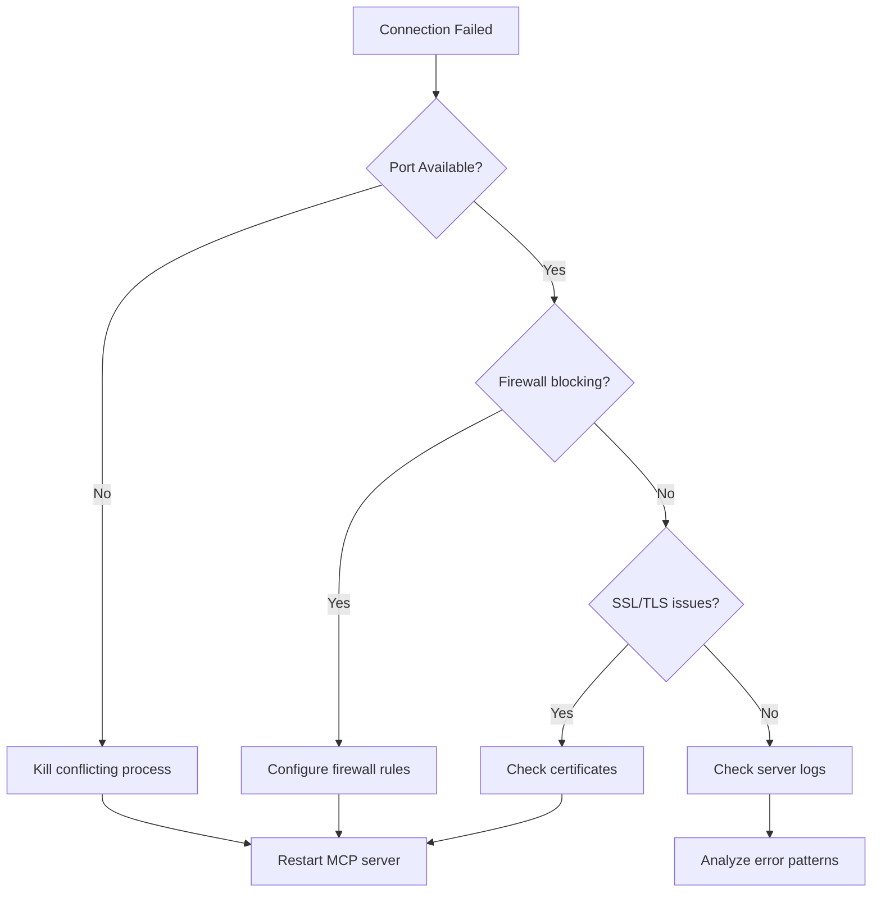

# 🔧 Advanced Troubleshooting Guide - UnrealBlueprintMCP

> **Version**: 1.0.0
> **Updated**: 2025-09-17
> **Scope**: Production-ready diagnostics and problem resolution

## 📋 Table of Contents

1. [Quick Diagnostic Checklist](#quick-diagnostic-checklist)
2. [WebSocket Connection Issues](#websocket-connection-issues)
3. [MCP Server Debugging](#mcp-server-debugging)
4. [Unreal Engine Plugin Issues](#unreal-engine-plugin-issues)
5. [Performance Bottleneck Analysis](#performance-bottleneck-analysis)
6. [Memory Leak Detection & Resolution](#memory-leak-detection--resolution)
7. [Log Analysis & Debugging Tools](#log-analysis--debugging-tools)
8. [Production Environment Monitoring](#production-environment-monitoring)
9. [Common Issues & Solutions](#common-issues--solutions)
10. [Emergency Recovery Procedures](#emergency-recovery-procedures)

---

## 🚨 Quick Diagnostic Checklist

### Basic System Health Check

```bash
# 1. Check MCP server status
ps aux | grep unreal_blueprint_mcp_server
netstat -tulpn | grep 6277

# 2. Verify WebSocket server
netstat -tulpn | grep 8080

# 3. Memory usage check
python3 -c "
import psutil
process = psutil.Process()
print(f'Memory: {process.memory_info().rss / 1024 / 1024:.2f} MB')
print(f'CPU: {process.cpu_percent():.2f}%')
"

# 4. Check log files
tail -f /tmp/unreal_blueprint_mcp.log
```

### Quick Problem Classification

| Symptom | Priority | Initial Check |
|---------|----------|---------------|
| 🔴 Server won't start | **Critical** | Port conflicts, permissions |
| 🟡 Slow response times | **High** | Memory usage, connection count |
| 🟢 Blueprint creation fails | **Medium** | Unreal Editor state, validation |
| 🔵 Client connection drops | **Low** | Network stability, timeouts |

---

## 🌐 WebSocket Connection Issues

### 1. Connection Establishment Problems

#### Diagnostic Commands

```bash
# Test WebSocket connectivity
wscat -c ws://localhost:6277
wscat -c ws://localhost:8080

# Check for port conflicts
sudo lsof -i :6277
sudo lsof -i :8080

# Network interface verification
ss -tlnp | grep -E ":(6277|8080)"
```

#### Common Issues & Solutions



### 2. Authentication & Session Management

#### Session Token Validation

```python
#!/usr/bin/env python3
"""
WebSocket connection tester with authentication
"""
import asyncio
import websockets
import json
import logging

async def test_connection_with_auth():
    """Test authenticated WebSocket connection"""
    try:
        # Read auth token from environment or config
        auth_token = "YOUR_SESSION_TOKEN"

        headers = {"Authorization": f"Bearer {auth_token}"}

        async with websockets.connect(
            "ws://localhost:6277",
            extra_headers=headers,
            timeout=10
        ) as websocket:

            # Send ping message
            ping_msg = {
                "jsonrpc": "2.0",
                "id": 1,
                "method": "ping"
            }

            await websocket.send(json.dumps(ping_msg))
            response = await websocket.recv()

            print(f"✅ Connection successful: {response}")

    except websockets.exceptions.ConnectionClosed as e:
        print(f"❌ Connection closed: {e}")
    except Exception as e:
        print(f"❌ Connection failed: {e}")

if __name__ == "__main__":
    asyncio.run(test_connection_with_auth())
```

### 3. Connection Timeout & Stability

#### Enhanced Connection Monitoring

```python
#!/usr/bin/env python3
"""
Connection stability monitor
"""
import asyncio
import websockets
import time
import statistics
from datetime import datetime

class ConnectionMonitor:
    def __init__(self, url="ws://localhost:6277"):
        self.url = url
        self.response_times = []
        self.failed_connections = 0
        self.successful_connections = 0

    async def ping_test(self, websocket):
        """Send ping and measure response time"""
        start_time = time.time()

        ping_msg = {
            "jsonrpc": "2.0",
            "id": int(time.time()),
            "method": "ping"
        }

        await websocket.send(json.dumps(ping_msg))
        response = await websocket.recv()

        end_time = time.time()
        response_time = (end_time - start_time) * 1000  # ms

        self.response_times.append(response_time)
        return response_time

    async def monitor_connection(self, duration_minutes=5):
        """Monitor connection stability over time"""
        end_time = time.time() + (duration_minutes * 60)

        while time.time() < end_time:
            try:
                async with websockets.connect(self.url, timeout=5) as ws:
                    response_time = await self.ping_test(ws)
                    self.successful_connections += 1

                    print(f"{datetime.now()}: ✅ Response time: {response_time:.2f}ms")

            except Exception as e:
                self.failed_connections += 1
                print(f"{datetime.now()}: ❌ Connection failed: {e}")

            await asyncio.sleep(10)  # Test every 10 seconds

        self.print_statistics()

    def print_statistics(self):
        """Print connection statistics"""
        total_tests = self.successful_connections + self.failed_connections
        success_rate = (self.successful_connections / total_tests) * 100

        print("\n📊 Connection Statistics:")
        print(f"Success Rate: {success_rate:.2f}%")
        print(f"Failed Connections: {self.failed_connections}")

        if self.response_times:
            avg_time = statistics.mean(self.response_times)
            max_time = max(self.response_times)
            min_time = min(self.response_times)

            print(f"Avg Response Time: {avg_time:.2f}ms")
            print(f"Max Response Time: {max_time:.2f}ms")
            print(f"Min Response Time: {min_time:.2f}ms")

# Usage
if __name__ == "__main__":
    monitor = ConnectionMonitor()
    asyncio.run(monitor.monitor_connection(duration_minutes=5))
```

---

## 🖥️ MCP Server Debugging

### 1. Server Startup Issues

#### Comprehensive Startup Diagnostics

```bash
#!/bin/bash
# MCP Server startup diagnostics script

echo "🔍 MCP Server Startup Diagnostics"
echo "================================="

# Check Python environment
echo "📌 Python Environment:"
which python3
python3 --version
pip list | grep -E "(fastmcp|websockets|pydantic)"

# Check virtual environment
echo -e "\n📌 Virtual Environment:"
if [[ "$VIRTUAL_ENV" != "" ]]; then
    echo "✅ Virtual environment active: $VIRTUAL_ENV"
else
    echo "⚠️  No virtual environment detected"
fi

# Check required dependencies
echo -e "\n📌 Dependencies Check:"
python3 -c "
try:
    import fastmcp
    print('✅ fastmcp imported successfully')
except ImportError as e:
    print(f'❌ fastmcp import failed: {e}')

try:
    import websockets
    print('✅ websockets imported successfully')
except ImportError as e:
    print(f'❌ websockets import failed: {e}')

try:
    import pydantic
    print('✅ pydantic imported successfully')
except ImportError as e:
    print(f'❌ pydantic import failed: {e}')
"

# Check port availability
echo -e "\n📌 Port Availability:"
for port in 6277 8080; do
    if lsof -i :$port > /dev/null 2>&1; then
        echo "❌ Port $port is in use:"
        lsof -i :$port
    else
        echo "✅ Port $port is available"
    fi
done

# Check file permissions
echo -e "\n📌 File Permissions:"
ls -la unreal_blueprint_mcp_server.py
if [[ -x "unreal_blueprint_mcp_server.py" ]]; then
    echo "✅ Server script is executable"
else
    echo "⚠️  Server script is not executable"
    echo "   Run: chmod +x unreal_blueprint_mcp_server.py"
fi

# Check log directory
echo -e "\n📌 Log Directory:"
if [[ -d "/tmp" && -w "/tmp" ]]; then
    echo "✅ Log directory /tmp is writable"
else
    echo "❌ Log directory /tmp is not writable"
fi

echo -e "\n✅ Diagnostics complete. Check any ❌ items above."
```

### 2. Memory Management Debugging

#### Memory Usage Analysis

```python
#!/usr/bin/env python3
"""
Advanced memory monitoring for MCP server
"""
import psutil
import gc
import tracemalloc
import asyncio
import time
from datetime import datetime
from memory_manager import get_memory_manager, MemoryStats

class AdvancedMemoryMonitor:
    def __init__(self):
        self.memory_manager = get_memory_manager()
        self.baseline_memory = None
        self.memory_snapshots = []

    async def start_monitoring(self):
        """Start comprehensive memory monitoring"""
        tracemalloc.start()

        # Get baseline memory usage
        process = psutil.Process()
        self.baseline_memory = process.memory_info().rss / 1024 / 1024  # MB

        print(f"📊 Memory monitoring started")
        print(f"📊 Baseline memory: {self.baseline_memory:.2f} MB")

        # Monitor memory every 30 seconds
        while True:
            await self.take_memory_snapshot()
            await asyncio.sleep(30)

    async def take_memory_snapshot(self):
        """Take detailed memory snapshot"""
        process = psutil.Process()
        memory_info = process.memory_info()

        # Create memory stats
        stats = MemoryStats(
            timestamp=time.time(),
            rss_mb=memory_info.rss / 1024 / 1024,
            vms_mb=memory_info.vms / 1024 / 1024,
            percent=process.memory_percent(),
            available_mb=psutil.virtual_memory().available / 1024 / 1024,
            gc_objects=len(gc.get_objects()),
            gc_collections={
                0: gc.get_count()[0],
                1: gc.get_count()[1],
                2: gc.get_count()[2]
            }
        )

        self.memory_snapshots.append(stats)

        # Check for memory growth
        memory_growth = stats.rss_mb - self.baseline_memory

        if memory_growth > 50:  # 50MB growth threshold
            print(f"⚠️  Memory growth detected: +{memory_growth:.2f} MB")
            await self.analyze_memory_growth()

        # Print current stats
        print(f"{datetime.now()}: Memory: {stats.rss_mb:.2f} MB, "
              f"Objects: {stats.gc_objects}, Growth: +{memory_growth:.2f} MB")

    async def analyze_memory_growth(self):
        """Analyze memory growth patterns"""
        if len(self.memory_snapshots) < 2:
            return

        recent_snapshots = self.memory_snapshots[-10:]  # Last 10 snapshots

        # Calculate growth rate
        first_snapshot = recent_snapshots[0]
        last_snapshot = recent_snapshots[-1]

        time_diff = last_snapshot.timestamp - first_snapshot.timestamp
        memory_diff = last_snapshot.rss_mb - first_snapshot.rss_mb

        if time_diff > 0:
            growth_rate = memory_diff / time_diff  # MB per second
            print(f"📈 Memory growth rate: {growth_rate:.3f} MB/sec")

        # Check for potential leaks
        if growth_rate > 0.1:  # 0.1 MB/sec threshold
            print("🚨 Potential memory leak detected!")
            await self.trigger_leak_detection()

    async def trigger_leak_detection(self):
        """Trigger memory leak detection"""
        print("🔍 Running memory leak detection...")

        # Force garbage collection
        collected = gc.collect()
        print(f"🗑️  Garbage collected {collected} objects")

        # Get current memory snapshot
        snapshot = tracemalloc.take_snapshot()
        top_stats = snapshot.statistics('lineno')

        print("🔝 Top 10 memory allocations:")
        for index, stat in enumerate(top_stats[:10], 1):
            print(f"{index}. {stat}")

        # Use memory manager's leak detection
        if hasattr(self.memory_manager, 'detect_leaks'):
            leaks = await self.memory_manager.detect_leaks()
            if leaks:
                print(f"🚨 {len(leaks)} potential leaks detected:")
                for leak in leaks[:5]:  # Show top 5 leaks
                    print(f"   - {leak.leak_type}: {leak.size_mb:.2f} MB")

# Usage
if __name__ == "__main__":
    monitor = AdvancedMemoryMonitor()
    asyncio.run(monitor.start_monitoring())
```

### 3. Server Performance Profiling

#### CPU & I/O Performance Analysis

```python
#!/usr/bin/env python3
"""
MCP Server Performance Profiler
"""
import cProfile
import pstats
import asyncio
import time
import psutil
from concurrent.futures import ThreadPoolExecutor

class PerformanceProfiler:
    def __init__(self):
        self.profiler = cProfile.Profile()
        self.start_time = None
        self.cpu_samples = []
        self.io_samples = []

    async def start_profiling(self, duration_seconds=300):
        """Start comprehensive performance profiling"""
        print(f"🚀 Starting performance profiling for {duration_seconds} seconds...")

        self.start_time = time.time()
        self.profiler.enable()

        # Start background monitoring
        monitor_task = asyncio.create_task(self.monitor_resources())

        # Wait for profiling duration
        await asyncio.sleep(duration_seconds)

        # Stop profiling
        self.profiler.disable()
        monitor_task.cancel()

        # Analyze results
        await self.analyze_results()

    async def monitor_resources(self):
        """Monitor CPU and I/O resources"""
        process = psutil.Process()

        try:
            while True:
                # CPU usage
                cpu_percent = process.cpu_percent()
                self.cpu_samples.append(cpu_percent)

                # I/O statistics
                try:
                    io_counters = process.io_counters()
                    self.io_samples.append({
                        'read_bytes': io_counters.read_bytes,
                        'write_bytes': io_counters.write_bytes,
                        'read_count': io_counters.read_count,
                        'write_count': io_counters.write_count
                    })
                except (psutil.AccessDenied, AttributeError):
                    pass  # I/O stats not available on all platforms

                await asyncio.sleep(1)  # Sample every second

        except asyncio.CancelledError:
            pass

    async def analyze_results(self):
        """Analyze profiling results"""
        print("\n📊 Performance Analysis Results")
        print("=" * 40)

        # CPU analysis
        if self.cpu_samples:
            avg_cpu = sum(self.cpu_samples) / len(self.cpu_samples)
            max_cpu = max(self.cpu_samples)

            print(f"🖥️  CPU Usage:")
            print(f"   Average: {avg_cpu:.2f}%")
            print(f"   Maximum: {max_cpu:.2f}%")

            if avg_cpu > 50:
                print("⚠️  High CPU usage detected!")

        # Function profiling
        stats = pstats.Stats(self.profiler)
        stats.sort_stats('cumulative')

        print(f"\n🔝 Top 10 Time-Consuming Functions:")
        stats.print_stats(10)

        # I/O analysis
        if len(self.io_samples) >= 2:
            first_io = self.io_samples[0]
            last_io = self.io_samples[-1]

            read_bytes = last_io['read_bytes'] - first_io['read_bytes']
            write_bytes = last_io['write_bytes'] - first_io['write_bytes']

            print(f"\n💾 I/O Statistics:")
            print(f"   Bytes Read: {read_bytes / 1024 / 1024:.2f} MB")
            print(f"   Bytes Written: {write_bytes / 1024 / 1024:.2f} MB")

# Usage
if __name__ == "__main__":
    profiler = PerformanceProfiler()
    asyncio.run(profiler.start_profiling(duration_seconds=300))
```

---

## 🎮 Unreal Engine Plugin Issues

### 1. Plugin Loading & Compilation

#### Plugin Diagnostic Script

```cpp
// Add this to your UnrealBlueprintMCP.cpp for debugging
DEFINE_LOG_CATEGORY_STATIC(LogUnrealBlueprintMCP, Log, All);

void FUnrealBlueprintMCPModule::StartupModule()
{
    UE_LOG(LogUnrealBlueprintMCP, Warning, TEXT("🚀 UnrealBlueprintMCP Module Starting..."));

    // Check WebSocket module availability
    if (FModuleManager::Get().IsModuleLoaded("WebSockets"))
    {
        UE_LOG(LogUnrealBlueprintMCP, Log, TEXT("✅ WebSockets module is loaded"));
    }
    else
    {
        UE_LOG(LogUnrealBlueprintMCP, Error, TEXT("❌ WebSockets module is not loaded"));
    }

    // Check Engine subsystems
    if (GEditor)
    {
        UE_LOG(LogUnrealBlueprintMCP, Log, TEXT("✅ Editor subsystem available"));
    }
    else
    {
        UE_LOG(LogUnrealBlueprintMCP, Warning, TEXT("⚠️  Editor subsystem not available"));
    }

    // Initialize MCP client
    MCPClient = MakeShared<FMCPClient>();
    if (MCPClient.IsValid())
    {
        UE_LOG(LogUnrealBlueprintMCP, Log, TEXT("✅ MCP Client initialized"));

        // Test connection
        MCPClient->TestConnection();
    }
    else
    {
        UE_LOG(LogUnrealBlueprintMCP, Error, TEXT("❌ Failed to initialize MCP Client"));
    }
}
```

#### Blueprint Asset Loading Issues

```cpp
// MCPBlueprintManager.cpp - Enhanced error handling
bool UMCPBlueprintManager::CreateBlueprint(const FString& BlueprintName,
                                          const FString& ParentClass,
                                          const FString& AssetPath)
{
    UE_LOG(LogMCPBlueprintManager, Log,
           TEXT("🎯 Creating blueprint: %s (Parent: %s) at %s"),
           *BlueprintName, *ParentClass, *AssetPath);

    // Validate input parameters
    if (BlueprintName.IsEmpty())
    {
        UE_LOG(LogMCPBlueprintManager, Error, TEXT("❌ Blueprint name is empty"));
        return false;
    }

    if (!IsValidAssetPath(AssetPath))
    {
        UE_LOG(LogMCPBlueprintManager, Error, TEXT("❌ Invalid asset path: %s"), *AssetPath);
        return false;
    }

    // Check if blueprint already exists
    FString BlueprintPath = FString::Printf(TEXT("%s%s"), *AssetPath, *BlueprintName);
    if (UBlueprint* ExistingBP = LoadObject<UBlueprint>(nullptr, *BlueprintPath))
    {
        UE_LOG(LogMCPBlueprintManager, Warning,
               TEXT("⚠️  Blueprint already exists: %s"), *BlueprintPath);
        return false;
    }

    // Find parent class
    UClass* ParentUClass = FindParentClass(ParentClass);
    if (!ParentUClass)
    {
        UE_LOG(LogMCPBlueprintManager, Error,
               TEXT("❌ Parent class not found: %s"), *ParentClass);
        return false;
    }

    // Create blueprint with error handling
    UBlueprint* NewBlueprint = nullptr;
    try
    {
        NewBlueprint = FKismetEditorUtilities::CreateBlueprint(
            ParentUClass,
            GetTransientPackage(),
            FName(*BlueprintName),
            BPTYPE_Normal,
            UBlueprint::StaticClass(),
            UBlueprintGeneratedClass::StaticClass()
        );

        if (NewBlueprint)
        {
            UE_LOG(LogMCPBlueprintManager, Log,
                   TEXT("✅ Blueprint created successfully: %s"), *BlueprintName);

            // Save the blueprint
            FString PackageName = FString::Printf(TEXT("%s%s"), *AssetPath, *BlueprintName);
            UPackage* Package = CreatePackage(*PackageName);

            if (Package)
            {
                NewBlueprint->Rename(*BlueprintName, Package);
                FAssetRegistryModule::AssetCreated(NewBlueprint);

                // Mark package as dirty and save
                Package->MarkPackageDirty();
                FString const PackageFileName = FPackageName::LongPackageNameToFilename(
                    PackageName, FPackageName::GetAssetPackageExtension());

                bool bSaved = UPackage::SavePackage(
                    Package, NewBlueprint, EObjectFlags::RF_Public | EObjectFlags::RF_Standalone,
                    *PackageFileName, GError, nullptr, true, true, SAVE_NoError);

                if (bSaved)
                {
                    UE_LOG(LogMCPBlueprintManager, Log,
                           TEXT("✅ Blueprint saved successfully: %s"), *PackageFileName);
                    return true;
                }
                else
                {
                    UE_LOG(LogMCPBlueprintManager, Error,
                           TEXT("❌ Failed to save blueprint: %s"), *PackageFileName);
                }
            }
        }
    }
    catch (const std::exception& e)
    {
        UE_LOG(LogMCPBlueprintManager, Error,
               TEXT("❌ Exception during blueprint creation: %s"), UTF8_TO_TCHAR(e.what()));
    }

    return false;
}
```

### 2. Editor Integration Issues

#### Editor State Validation

```cpp
// MCPStatusWidget.cpp - Enhanced status checking
void SMCPStatusWidget::UpdateStatus()
{
    FString StatusText;
    FSlateColor StatusColor;

    // Check Editor state
    if (!GEditor)
    {
        StatusText = TEXT("❌ Editor Not Available");
        StatusColor = FSlateColor(FLinearColor::Red);
    }
    else if (GEditor->PlayWorld)
    {
        StatusText = TEXT("⚠️  Play Mode Active - Blueprint operations disabled");
        StatusColor = FSlateColor(FLinearColor(1.0f, 0.5f, 0.0f, 1.0f)); // Orange
    }
    else if (GEditor->bIsSimulatingInEditor)
    {
        StatusText = TEXT("⚠️  Simulation Mode Active");
        StatusColor = FSlateColor(FLinearColor(1.0f, 0.5f, 0.0f, 1.0f)); // Orange
    }
    else
    {
        // Check MCP connection
        if (MCPClient && MCPClient->IsConnected())
        {
            StatusText = TEXT("✅ Connected & Ready");
            StatusColor = FSlateColor(FLinearColor::Green);
        }
        else
        {
            StatusText = TEXT("🔄 Connecting to MCP Server...");
            StatusColor = FSlateColor(FLinearColor::Yellow);
        }
    }

    // Update UI
    StatusTextBlock->SetText(FText::FromString(StatusText));
    StatusTextBlock->SetColorAndOpacity(StatusColor);

    // Update connection statistics
    if (MCPClient)
    {
        FString StatsText = FString::Printf(
            TEXT("Requests: %d | Errors: %d | Uptime: %s"),
            MCPClient->GetRequestCount(),
            MCPClient->GetErrorCount(),
            *MCPClient->GetUptimeString()
        );

        StatsTextBlock->SetText(FText::FromString(StatsText));
    }
}
```

---

## ⚡ Performance Bottleneck Analysis

### 1. Request/Response Latency Analysis

```python
#!/usr/bin/env python3
"""
Latency analysis for MCP requests
"""
import asyncio
import websockets
import json
import time
import statistics
from datetime import datetime

class LatencyAnalyzer:
    def __init__(self, server_url="ws://localhost:6277"):
        self.server_url = server_url
        self.latency_data = {}

    async def measure_tool_latency(self, tool_name, params, iterations=10):
        """Measure latency for specific MCP tool"""
        latencies = []

        print(f"🔍 Measuring latency for '{tool_name}' ({iterations} iterations)")

        for i in range(iterations):
            try:
                async with websockets.connect(self.server_url, timeout=30) as ws:
                    start_time = time.time()

                    request = {
                        "jsonrpc": "2.0",
                        "id": i + 1,
                        "method": "tools/call",
                        "params": {
                            "name": tool_name,
                            "arguments": params
                        }
                    }

                    await ws.send(json.dumps(request))
                    response = await ws.recv()

                    end_time = time.time()
                    latency = (end_time - start_time) * 1000  # Convert to ms
                    latencies.append(latency)

                    print(f"  Iteration {i+1}: {latency:.2f}ms")

                    # Small delay between requests
                    await asyncio.sleep(0.5)

            except Exception as e:
                print(f"  ❌ Iteration {i+1} failed: {e}")

        if latencies:
            self.latency_data[tool_name] = {
                'samples': latencies,
                'mean': statistics.mean(latencies),
                'median': statistics.median(latencies),
                'stdev': statistics.stdev(latencies) if len(latencies) > 1 else 0,
                'min': min(latencies),
                'max': max(latencies),
                'p95': self.percentile(latencies, 95),
                'p99': self.percentile(latencies, 99)
            }

        return latencies

    def percentile(self, data, percentile):
        """Calculate percentile value"""
        size = len(data)
        if size == 0:
            return 0
        data_sorted = sorted(data)
        index = (percentile / 100) * (size - 1)
        if index.is_integer():
            return data_sorted[int(index)]
        else:
            lower = data_sorted[int(index)]
            upper = data_sorted[int(index) + 1]
            return lower + (upper - lower) * (index - int(index))

    async def comprehensive_latency_test(self):
        """Run comprehensive latency tests for all tools"""
        test_scenarios = [
            {
                "tool": "get_server_status",
                "params": {},
                "iterations": 20
            },
            {
                "tool": "list_supported_blueprint_classes",
                "params": {},
                "iterations": 15
            },
            {
                "tool": "create_blueprint",
                "params": {
                    "blueprint_name": "LatencyTestActor",
                    "parent_class": "Actor",
                    "asset_path": "/Game/Tests/"
                },
                "iterations": 10
            },
            {
                "tool": "test_unreal_connection",
                "params": {},
                "iterations": 15
            }
        ]

        print("🚀 Starting comprehensive latency analysis...")
        print("=" * 50)

        for scenario in test_scenarios:
            await self.measure_tool_latency(
                scenario["tool"],
                scenario["params"],
                scenario["iterations"]
            )
            print()  # Add spacing between tests

        self.print_analysis_report()

    def print_analysis_report(self):
        """Print detailed latency analysis report"""
        print("📊 LATENCY ANALYSIS REPORT")
        print("=" * 50)

        for tool_name, data in self.latency_data.items():
            print(f"\n🔧 Tool: {tool_name}")
            print(f"   Samples: {len(data['samples'])}")
            print(f"   Mean: {data['mean']:.2f}ms")
            print(f"   Median: {data['median']:.2f}ms")
            print(f"   Std Dev: {data['stdev']:.2f}ms")
            print(f"   Min: {data['min']:.2f}ms")
            print(f"   Max: {data['max']:.2f}ms")
            print(f"   95th percentile: {data['p95']:.2f}ms")
            print(f"   99th percentile: {data['p99']:.2f}ms")

            # Performance assessment
            mean_latency = data['mean']
            if mean_latency < 100:
                assessment = "✅ Excellent"
            elif mean_latency < 500:
                assessment = "👍 Good"
            elif mean_latency < 1000:
                assessment = "⚠️  Acceptable"
            else:
                assessment = "❌ Poor"

            print(f"   Assessment: {assessment}")

        # Overall system assessment
        overall_mean = statistics.mean([
            data['mean'] for data in self.latency_data.values()
        ])

        print(f"\n🎯 Overall System Performance: {overall_mean:.2f}ms average")

        if overall_mean > 500:
            print("\n🚨 PERFORMANCE RECOMMENDATIONS:")
            print("   - Check system resources (CPU, Memory)")
            print("   - Analyze WebSocket connection stability")
            print("   - Consider optimizing MCP tool implementations")
            print("   - Review Unreal Engine editor performance")

# Usage
if __name__ == "__main__":
    analyzer = LatencyAnalyzer()
    asyncio.run(analyzer.comprehensive_latency_test())
```

### 2. Throughput & Concurrency Testing

```python
#!/usr/bin/env python3
"""
Throughput and concurrency testing for MCP server
"""
import asyncio
import websockets
import json
import time
from concurrent.futures import ThreadPoolExecutor
import threading

class ConcurrencyTester:
    def __init__(self, server_url="ws://localhost:6277"):
        self.server_url = server_url
        self.results = []
        self.lock = threading.Lock()

    async def single_request_worker(self, worker_id, num_requests):
        """Worker that sends multiple requests on single connection"""
        successes = 0
        failures = 0
        total_time = 0

        try:
            async with websockets.connect(self.server_url, timeout=30) as ws:
                for i in range(num_requests):
                    start_time = time.time()

                    request = {
                        "jsonrpc": "2.0",
                        "id": f"{worker_id}_{i}",
                        "method": "tools/call",
                        "params": {
                            "name": "get_server_status",
                            "arguments": {}
                        }
                    }

                    try:
                        await ws.send(json.dumps(request))
                        response = await ws.recv()

                        end_time = time.time()
                        request_time = end_time - start_time
                        total_time += request_time

                        successes += 1

                    except Exception as e:
                        failures += 1
                        print(f"Worker {worker_id} request {i} failed: {e}")

        except Exception as e:
            print(f"Worker {worker_id} connection failed: {e}")
            failures = num_requests

        with self.lock:
            self.results.append({
                'worker_id': worker_id,
                'successes': successes,
                'failures': failures,
                'total_time': total_time,
                'avg_time': total_time / max(successes, 1)
            })

    async def test_concurrency(self, num_workers=10, requests_per_worker=20):
        """Test server concurrency with multiple workers"""
        print(f"🚀 Testing concurrency: {num_workers} workers, "
              f"{requests_per_worker} requests each")
        print(f"📊 Total requests: {num_workers * requests_per_worker}")

        start_time = time.time()

        # Create and start workers
        tasks = []
        for worker_id in range(num_workers):
            task = asyncio.create_task(
                self.single_request_worker(worker_id, requests_per_worker)
            )
            tasks.append(task)

        # Wait for all workers to complete
        await asyncio.gather(*tasks)

        end_time = time.time()
        total_test_time = end_time - start_time

        # Calculate statistics
        total_successes = sum(r['successes'] for r in self.results)
        total_failures = sum(r['failures'] for r in self.results)
        total_requests = total_successes + total_failures

        throughput = total_successes / total_test_time  # requests per second
        success_rate = (total_successes / total_requests) * 100

        print(f"\n📊 CONCURRENCY TEST RESULTS")
        print("=" * 40)
        print(f"Test Duration: {total_test_time:.2f} seconds")
        print(f"Total Requests: {total_requests}")
        print(f"Successful Requests: {total_successes}")
        print(f"Failed Requests: {total_failures}")
        print(f"Success Rate: {success_rate:.2f}%")
        print(f"Throughput: {throughput:.2f} requests/second")

        # Per-worker breakdown
        print(f"\n👥 Per-Worker Results:")
        for result in self.results:
            worker_success_rate = (result['successes'] /
                                 (result['successes'] + result['failures'])) * 100
            print(f"Worker {result['worker_id']}: "
                  f"{result['successes']}/{result['successes'] + result['failures']} "
                  f"({worker_success_rate:.1f}%) - "
                  f"Avg: {result['avg_time']*1000:.2f}ms")

        # Performance assessment
        if success_rate >= 99 and throughput >= 50:
            assessment = "✅ Excellent concurrency handling"
        elif success_rate >= 95 and throughput >= 20:
            assessment = "👍 Good concurrency handling"
        elif success_rate >= 90:
            assessment = "⚠️  Acceptable concurrency handling"
        else:
            assessment = "❌ Poor concurrency handling"

        print(f"\n🎯 Assessment: {assessment}")

        if success_rate < 95 or throughput < 20:
            print("\n🚨 RECOMMENDATIONS:")
            print("   - Check server resource limits")
            print("   - Review WebSocket connection limits")
            print("   - Consider connection pooling")
            print("   - Monitor memory usage under load")

# Usage
if __name__ == "__main__":
    tester = ConcurrencyTester()
    asyncio.run(tester.test_concurrency(num_workers=10, requests_per_worker=20))
```

---

## 🧠 Memory Leak Detection & Resolution

### 1. Advanced Memory Leak Detection

Based on the enhanced memory manager in the project, here's how to use it for leak detection:

```python
#!/usr/bin/env python3
"""
Advanced memory leak detection using the enhanced memory manager
"""
import asyncio
import gc
import weakref
import tracemalloc
from memory_manager import get_memory_manager, MemoryLeak
from datetime import datetime, timedelta

class AdvancedLeakDetector:
    def __init__(self):
        self.memory_manager = get_memory_manager()
        self.reference_tracker = {}
        self.object_counts = {}
        self.snapshots = []

    async def start_leak_detection(self, monitoring_duration=600):
        """Start comprehensive leak detection"""
        print("🔍 Starting advanced memory leak detection...")

        # Start tracemalloc
        tracemalloc.start()

        # Take baseline snapshot
        await self.take_baseline_snapshot()

        # Monitor for specified duration
        end_time = datetime.now() + timedelta(seconds=monitoring_duration)
        snapshot_interval = 60  # Take snapshot every minute

        while datetime.now() < end_time:
            await asyncio.sleep(snapshot_interval)
            await self.take_memory_snapshot()
            await self.analyze_potential_leaks()

        # Final analysis
        await self.generate_leak_report()

    async def take_baseline_snapshot(self):
        """Take baseline memory snapshot"""
        # Force garbage collection
        gc.collect()

        # Count objects by type
        self.baseline_objects = {}
        for obj in gc.get_objects():
            obj_type = type(obj).__name__
            self.baseline_objects[obj_type] = self.baseline_objects.get(obj_type, 0) + 1

        # Take tracemalloc snapshot
        self.baseline_snapshot = tracemalloc.take_snapshot()

        print(f"📊 Baseline established: {len(gc.get_objects())} objects tracked")

    async def take_memory_snapshot(self):
        """Take current memory snapshot and compare with baseline"""
        # Force garbage collection
        collected = gc.collect()
        if collected > 0:
            print(f"🗑️  Garbage collected: {collected} objects")

        # Count current objects
        current_objects = {}
        for obj in gc.get_objects():
            obj_type = type(obj).__name__
            current_objects[obj_type] = current_objects.get(obj_type, 0) + 1

        # Calculate object growth
        object_growth = {}
        for obj_type, count in current_objects.items():
            baseline_count = self.baseline_objects.get(obj_type, 0)
            growth = count - baseline_count
            if growth > 0:
                object_growth[obj_type] = growth

        # Take tracemalloc snapshot
        current_snapshot = tracemalloc.take_snapshot()

        # Store snapshot data
        snapshot_data = {
            'timestamp': datetime.now(),
            'total_objects': len(gc.get_objects()),
            'object_growth': object_growth,
            'memory_snapshot': current_snapshot
        }

        self.snapshots.append(snapshot_data)

        # Print current status
        total_growth = sum(object_growth.values())
        if total_growth > 0:
            print(f"📈 {datetime.now()}: Object growth detected: +{total_growth} objects")

            # Show top growing object types
            top_growing = sorted(object_growth.items(), key=lambda x: x[1], reverse=True)[:5]
            for obj_type, growth in top_growing:
                print(f"   {obj_type}: +{growth}")

    async def analyze_potential_leaks(self):
        """Analyze potential memory leaks"""
        if len(self.snapshots) < 3:
            return  # Need at least 3 snapshots for trend analysis

        # Analyze growth trends over last 3 snapshots
        recent_snapshots = self.snapshots[-3:]

        # Check for consistent growth patterns
        consistent_growth = {}

        for obj_type in recent_snapshots[0]['object_growth']:
            growth_values = []
            for snapshot in recent_snapshots:
                growth = snapshot['object_growth'].get(obj_type, 0)
                growth_values.append(growth)

            # If object count is consistently growing
            if all(g > 0 for g in growth_values):
                avg_growth = sum(growth_values) / len(growth_values)
                consistent_growth[obj_type] = avg_growth

        # Report potential leaks
        if consistent_growth:
            print("🚨 Potential memory leaks detected:")

            leaks = []
            for obj_type, avg_growth in consistent_growth.items():
                if avg_growth >= 10:  # Threshold for significant growth
                    severity = "critical" if avg_growth >= 100 else "high" if avg_growth >= 50 else "medium"

                    leak = MemoryLeak(
                        timestamp=datetime.now().timestamp(),
                        leak_type=f"Object Growth - {obj_type}",
                        description=f"Consistent growth of {obj_type} objects",
                        size_mb=avg_growth * 0.001,  # Rough estimate
                        severity=severity
                    )

                    leaks.append(leak)
                    print(f"   - {obj_type}: {avg_growth:.1f} objects/minute ({severity})")

            # Use memory manager's leak detection
            if hasattr(self.memory_manager, 'report_leaks'):
                await self.memory_manager.report_leaks(leaks)

    async def generate_leak_report(self):
        """Generate comprehensive leak detection report"""
        print("\n📋 MEMORY LEAK DETECTION REPORT")
        print("=" * 50)

        if not self.snapshots:
            print("❌ No snapshots available for analysis")
            return

        # Overall statistics
        first_snapshot = self.snapshots[0]
        last_snapshot = self.snapshots[-1]

        total_duration = (last_snapshot['timestamp'] - first_snapshot['timestamp']).total_seconds()
        object_growth = last_snapshot['total_objects'] - first_snapshot['total_objects']

        print(f"🕒 Monitoring Duration: {total_duration / 60:.1f} minutes")
        print(f"📊 Total Object Growth: {object_growth} objects")
        print(f"📈 Growth Rate: {object_growth / (total_duration / 60):.2f} objects/minute")

        # Memory usage analysis
        if hasattr(self.memory_manager, 'get_memory_stats'):
            stats = await self.memory_manager.get_memory_stats()
            print(f"💾 Current Memory Usage: {stats.rss_mb:.2f} MB")

        # Top growing object types
        final_growth = last_snapshot['object_growth']
        if final_growth:
            print(f"\n🔝 Top Growing Object Types:")
            top_growth = sorted(final_growth.items(), key=lambda x: x[1], reverse=True)[:10]

            for obj_type, growth in top_growth:
                growth_rate = growth / (total_duration / 60)
                print(f"   {obj_type}: +{growth} total ({growth_rate:.2f}/min)")

        # Tracemalloc analysis
        if self.baseline_snapshot and last_snapshot['memory_snapshot']:
            print(f"\n🔍 Memory Allocation Analysis:")

            top_stats = last_snapshot['memory_snapshot'].compare_to(
                self.baseline_snapshot, 'lineno'
            )

            print("   Top 5 memory allocation increases:")
            for stat in top_stats[:5]:
                print(f"     {stat}")

        # Recommendations
        if object_growth > 1000 or (object_growth / (total_duration / 60)) > 50:
            print(f"\n🚨 LEAK MITIGATION RECOMMENDATIONS:")
            print("   1. Review object lifecycle management")
            print("   2. Check for circular references")
            print("   3. Ensure proper cleanup in async operations")
            print("   4. Consider using weak references where appropriate")
            print("   5. Review caching mechanisms for TTL compliance")
        else:
            print(f"\n✅ Memory usage appears stable")

# Usage
if __name__ == "__main__":
    detector = AdvancedLeakDetector()
    # Monitor for 10 minutes
    asyncio.run(detector.start_leak_detection(monitoring_duration=600))
```

### 2. Memory Optimization Strategies

```python
#!/usr/bin/env python3
"""
Memory optimization implementation for MCP server
"""
import asyncio
import gc
import weakref
from typing import Dict, Any, Optional
from memory_manager import get_memory_manager

class MemoryOptimizer:
    def __init__(self):
        self.memory_manager = get_memory_manager()
        self.optimization_tasks = []

    async def start_optimization_scheduler(self):
        """Start automatic memory optimization scheduler"""
        print("🚀 Starting memory optimization scheduler...")

        # Schedule different optimization tasks
        self.optimization_tasks = [
            asyncio.create_task(self.periodic_gc_cleanup()),
            asyncio.create_task(self.cache_optimization()),
            asyncio.create_task(self.connection_cleanup()),
            asyncio.create_task(self.memory_monitoring())
        ]

        # Wait for all tasks
        await asyncio.gather(*self.optimization_tasks)

    async def periodic_gc_cleanup(self):
        """Periodic garbage collection optimization"""
        while True:
            try:
                # Wait 5 minutes between cleanups
                await asyncio.sleep(300)

                print("🧹 Running periodic garbage collection...")

                # Collect statistics before cleanup
                before_objects = len(gc.get_objects())

                # Force full garbage collection
                collected = gc.collect()

                # Statistics after cleanup
                after_objects = len(gc.get_objects())
                objects_freed = before_objects - after_objects

                print(f"   Collected: {collected} objects")
                print(f"   Objects freed: {objects_freed}")

                # Log memory statistics
                if hasattr(self.memory_manager, 'get_memory_stats'):
                    stats = await self.memory_manager.get_memory_stats()
                    print(f"   Memory usage: {stats.rss_mb:.2f} MB")

            except Exception as e:
                print(f"❌ Error in periodic GC cleanup: {e}")
                await asyncio.sleep(60)  # Wait 1 minute before retry

    async def cache_optimization(self):
        """Optimize cache usage and TTL compliance"""
        while True:
            try:
                # Wait 2 minutes between cache optimizations
                await asyncio.sleep(120)

                if hasattr(self.memory_manager, 'optimize_caches'):
                    optimized_count = await self.memory_manager.optimize_caches()
                    if optimized_count > 0:
                        print(f"🗂️  Cache optimization: {optimized_count} entries cleaned")

            except Exception as e:
                print(f"❌ Error in cache optimization: {e}")
                await asyncio.sleep(60)

    async def connection_cleanup(self):
        """Clean up stale connections and references"""
        while True:
            try:
                # Wait 3 minutes between connection cleanups
                await asyncio.sleep(180)

                if hasattr(self.memory_manager, 'cleanup_stale_connections'):
                    cleaned_count = await self.memory_manager.cleanup_stale_connections()
                    if cleaned_count > 0:
                        print(f"🔌 Connection cleanup: {cleaned_count} stale connections removed")

            except Exception as e:
                print(f"❌ Error in connection cleanup: {e}")
                await asyncio.sleep(60)

    async def memory_monitoring(self):
        """Monitor memory usage and trigger optimizations"""
        while True:
            try:
                # Check every minute
                await asyncio.sleep(60)

                if hasattr(self.memory_manager, 'get_memory_stats'):
                    stats = await self.memory_manager.get_memory_stats()

                    # Trigger aggressive cleanup if memory usage is high
                    if stats.rss_mb > 500:  # 500MB threshold
                        print(f"⚠️  High memory usage detected: {stats.rss_mb:.2f} MB")
                        await self.aggressive_cleanup()

                    # Check for memory growth rate
                    if hasattr(self.memory_manager, 'check_memory_growth'):
                        growth_rate = await self.memory_manager.check_memory_growth()
                        if growth_rate > 10:  # 10MB/min growth threshold
                            print(f"📈 High memory growth rate: {growth_rate:.2f} MB/min")
                            await self.emergency_optimization()

            except Exception as e:
                print(f"❌ Error in memory monitoring: {e}")
                await asyncio.sleep(60)

    async def aggressive_cleanup(self):
        """Perform aggressive memory cleanup"""
        print("🚨 Performing aggressive memory cleanup...")

        try:
            # Force multiple garbage collection cycles
            for i in range(3):
                collected = gc.collect()
                print(f"   GC cycle {i+1}: {collected} objects collected")
                await asyncio.sleep(0.1)

            # Clear all caches if available
            if hasattr(self.memory_manager, 'clear_all_caches'):
                await self.memory_manager.clear_all_caches()
                print("   All caches cleared")

            # Force connection cleanup
            if hasattr(self.memory_manager, 'force_connection_cleanup'):
                await self.memory_manager.force_connection_cleanup()
                print("   Connection cleanup completed")

        except Exception as e:
            print(f"❌ Error in aggressive cleanup: {e}")

    async def emergency_optimization(self):
        """Emergency memory optimization procedures"""
        print("🆘 Running emergency memory optimization...")

        try:
            # Perform aggressive cleanup first
            await self.aggressive_cleanup()

            # Additional emergency measures
            if hasattr(self.memory_manager, 'emergency_optimize'):
                await self.memory_manager.emergency_optimize()

            # Consider restarting components if critically high
            if hasattr(self.memory_manager, 'get_memory_stats'):
                stats = await self.memory_manager.get_memory_stats()
                if stats.rss_mb > 1000:  # 1GB critical threshold
                    print("🚨 CRITICAL: Memory usage exceeds 1GB - consider restart")

        except Exception as e:
            print(f"❌ Error in emergency optimization: {e}")

    async def stop_optimization(self):
        """Stop all optimization tasks"""
        print("🛑 Stopping memory optimization scheduler...")

        for task in self.optimization_tasks:
            task.cancel()

        # Wait for tasks to be cancelled
        await asyncio.gather(*self.optimization_tasks, return_exceptions=True)

# Usage
if __name__ == "__main__":
    optimizer = MemoryOptimizer()

    try:
        asyncio.run(optimizer.start_optimization_scheduler())
    except KeyboardInterrupt:
        print("\n👋 Shutting down memory optimizer...")
        asyncio.run(optimizer.stop_optimization())
```

---

## 📊 Log Analysis & Debugging Tools

### 1. Centralized Log Analysis

```python
#!/usr/bin/env python3
"""
Centralized log analysis tool for UnrealBlueprintMCP
"""
import re
import json
import asyncio
from datetime import datetime, timedelta
from pathlib import Path
from collections import defaultdict, Counter
import matplotlib.pyplot as plt
import pandas as pd

class LogAnalyzer:
    def __init__(self, log_directory="/tmp"):
        self.log_directory = Path(log_directory)
        self.log_patterns = {
            'error': re.compile(r'ERROR|❌|Failed|Exception', re.IGNORECASE),
            'warning': re.compile(r'WARNING|⚠️|WARN', re.IGNORECASE),
            'connection': re.compile(r'connection|websocket|connect', re.IGNORECASE),
            'memory': re.compile(r'memory|leak|GC|garbage', re.IGNORECASE),
            'performance': re.compile(r'slow|timeout|latency|performance', re.IGNORECASE),
            'security': re.compile(r'security|validation|sanitiz', re.IGNORECASE)
        }

        self.log_stats = defaultdict(int)
        self.error_patterns = Counter()
        self.timeline_data = []

    def analyze_log_file(self, log_file_path):
        """Analyze a single log file"""
        try:
            with open(log_file_path, 'r', encoding='utf-8') as file:
                for line_num, line in enumerate(file, 1):
                    self.analyze_log_line(line, line_num, log_file_path)
        except Exception as e:
            print(f"❌ Error reading log file {log_file_path}: {e}")

    def analyze_log_line(self, line, line_num, file_path):
        """Analyze a single log line"""
        # Extract timestamp if present
        timestamp_match = re.search(r'(\d{4}-\d{2}-\d{2} \d{2}:\d{2}:\d{2})', line)
        timestamp = None
        if timestamp_match:
            try:
                timestamp = datetime.strptime(timestamp_match.group(1), '%Y-%m-%d %H:%M:%S')
            except ValueError:
                pass

        # Categorize log line
        for category, pattern in self.log_patterns.items():
            if pattern.search(line):
                self.log_stats[category] += 1

                # Store timeline data
                if timestamp:
                    self.timeline_data.append({
                        'timestamp': timestamp,
                        'category': category,
                        'line': line.strip(),
                        'file': file_path.name,
                        'line_num': line_num
                    })

                # Track error patterns
                if category == 'error':
                    error_type = self.extract_error_type(line)
                    self.error_patterns[error_type] += 1

    def extract_error_type(self, line):
        """Extract error type from log line"""
        # Common error patterns
        error_patterns = [
            r'ConnectionError|Connection.*failed',
            r'TimeoutError|Timeout',
            r'ValidationError|Invalid.*input',
            r'MemoryError|Out of memory',
            r'WebSocketException',
            r'JSONDecodeError',
            r'FileNotFoundError',
            r'PermissionError'
        ]

        for pattern in error_patterns:
            if re.search(pattern, line, re.IGNORECASE):
                return re.search(pattern, line, re.IGNORECASE).group(0)

        return "Unknown Error"

    def analyze_all_logs(self):
        """Analyze all log files in the directory"""
        print("🔍 Analyzing log files...")

        log_files = list(self.log_directory.glob("*.log"))
        if not log_files:
            print(f"❌ No log files found in {self.log_directory}")
            return

        for log_file in log_files:
            print(f"   Analyzing {log_file.name}...")
            self.analyze_log_file(log_file)

        self.generate_analysis_report()

    def generate_analysis_report(self):
        """Generate comprehensive analysis report"""
        print("\n📊 LOG ANALYSIS REPORT")
        print("=" * 50)

        # Overall statistics
        total_lines_analyzed = sum(self.log_stats.values())
        print(f"📈 Total lines analyzed: {total_lines_analyzed}")

        if total_lines_analyzed == 0:
            print("❌ No relevant log entries found")
            return

        # Category breakdown
        print(f"\n📋 Log Category Breakdown:")
        for category, count in sorted(self.log_stats.items(), key=lambda x: x[1], reverse=True):
            percentage = (count / total_lines_analyzed) * 100
            print(f"   {category.capitalize()}: {count} ({percentage:.1f}%)")

        # Error analysis
        if self.error_patterns:
            print(f"\n🚨 Top Error Types:")
            for error_type, count in self.error_patterns.most_common(10):
                print(f"   {error_type}: {count} occurrences")

        # Timeline analysis
        if self.timeline_data:
            self.analyze_timeline()

        # Generate recommendations
        self.generate_recommendations()

    def analyze_timeline(self):
        """Analyze log timeline for patterns"""
        if not self.timeline_data:
            return

        print(f"\n⏰ Timeline Analysis:")

        # Convert to DataFrame for easier analysis
        df = pd.DataFrame(self.timeline_data)
        df['hour'] = df['timestamp'].dt.hour

        # Peak activity hours
        hourly_activity = df.groupby('hour').size()
        peak_hour = hourly_activity.idxmax()
        peak_count = hourly_activity.max()

        print(f"   Peak activity hour: {peak_hour}:00 ({peak_count} events)")

        # Recent activity (last 24 hours)
        cutoff_time = datetime.now() - timedelta(hours=24)
        recent_data = df[df['timestamp'] > cutoff_time]

        if not recent_data.empty:
            print(f"   Recent activity (24h): {len(recent_data)} events")

            # Recent error rate
            recent_errors = recent_data[recent_data['category'] == 'error']
            if not recent_errors.empty:
                error_rate = len(recent_errors) / len(recent_data) * 100
                print(f"   Recent error rate: {error_rate:.2f}%")

        # Generate timeline plot if matplotlib is available
        try:
            self.generate_timeline_plot(df)
        except ImportError:
            print("   📊 Install matplotlib for timeline visualization")

    def generate_timeline_plot(self, df):
        """Generate timeline visualization"""
        plt.figure(figsize=(12, 6))

        # Plot events by category over time
        for category in df['category'].unique():
            category_data = df[df['category'] == category]
            hourly_counts = category_data.groupby(category_data['timestamp'].dt.hour).size()

            plt.plot(hourly_counts.index, hourly_counts.values,
                    label=category.capitalize(), marker='o')

        plt.xlabel('Hour of Day')
        plt.ylabel('Event Count')
        plt.title('Log Events Timeline')
        plt.legend()
        plt.grid(True, alpha=0.3)

        # Save plot
        plot_path = self.log_directory / 'log_timeline.png'
        plt.savefig(plot_path, dpi=150, bbox_inches='tight')
        plt.close()

        print(f"   📊 Timeline plot saved: {plot_path}")

    def generate_recommendations(self):
        """Generate recommendations based on log analysis"""
        print(f"\n💡 RECOMMENDATIONS:")

        total_events = sum(self.log_stats.values())

        # Error rate recommendations
        error_rate = (self.log_stats['error'] / total_events) * 100 if total_events > 0 else 0

        if error_rate > 5:
            print(f"   🚨 High error rate ({error_rate:.1f}%) - investigate error patterns")
        elif error_rate > 2:
            print(f"   ⚠️  Moderate error rate ({error_rate:.1f}%) - monitor closely")
        else:
            print(f"   ✅ Low error rate ({error_rate:.1f}%) - system appears stable")

        # Memory recommendations
        memory_events = self.log_stats['memory']
        if memory_events > 10:
            print(f"   🧠 High memory-related events ({memory_events}) - check memory usage")

        # Performance recommendations
        performance_events = self.log_stats['performance']
        if performance_events > 5:
            print(f"   ⚡ Performance issues detected ({performance_events}) - run performance analysis")

        # Connection recommendations
        connection_events = self.log_stats['connection']
        if connection_events > 20:
            print(f"   🔌 High connection activity ({connection_events}) - monitor connection stability")

        # Security recommendations
        security_events = self.log_stats['security']
        if security_events > 0:
            print(f"   🔒 Security events detected ({security_events}) - review security logs")

# Usage
if __name__ == "__main__":
    analyzer = LogAnalyzer("/tmp")
    analyzer.analyze_all_logs()
```

### 2. Real-time Log Monitoring

```python
#!/usr/bin/env python3
"""
Real-time log monitoring with alerting
"""
import asyncio
import aiofiles
import re
from datetime import datetime
from pathlib import Path
from collections import deque
import json

class RealTimeLogMonitor:
    def __init__(self, log_file_path="/tmp/unreal_blueprint_mcp.log"):
        self.log_file_path = Path(log_file_path)
        self.alert_patterns = {
            'critical': [
                re.compile(r'CRITICAL|FATAL|💀', re.IGNORECASE),
                re.compile(r'Memory.*exceed|Out of memory', re.IGNORECASE),
                re.compile(r'Server.*crash|System.*crash', re.IGNORECASE)
            ],
            'error': [
                re.compile(r'ERROR|❌|Exception|Failed', re.IGNORECASE),
                re.compile(r'Connection.*lost|WebSocket.*error', re.IGNORECASE),
                re.compile(r'Validation.*failed|Security.*violation', re.IGNORECASE)
            ],
            'warning': [
                re.compile(r'WARNING|⚠️|WARN', re.IGNORECASE),
                re.compile(r'High.*memory|Memory.*leak|Performance.*degraded', re.IGNORECASE),
                re.compile(r'Connection.*timeout|Slow.*response', re.IGNORECASE)
            ]
        }

        self.alert_handlers = {
            'critical': self.handle_critical_alert,
            'error': self.handle_error_alert,
            'warning': self.handle_warning_alert
        }

        self.recent_lines = deque(maxlen=100)  # Keep last 100 lines
        self.alert_history = deque(maxlen=50)   # Keep last 50 alerts
        self.is_monitoring = False

    async def start_monitoring(self):
        """Start real-time log monitoring"""
        print(f"🔍 Starting real-time monitoring of {self.log_file_path}")

        if not self.log_file_path.exists():
            print(f"❌ Log file not found: {self.log_file_path}")
            return

        self.is_monitoring = True

        try:
            async with aiofiles.open(self.log_file_path, 'r') as file:
                # Seek to end of file to monitor new entries only
                await file.seek(0, 2)

                while self.is_monitoring:
                    line = await file.readline()

                    if line:
                        await self.process_log_line(line.strip())
                    else:
                        # No new line, wait a bit
                        await asyncio.sleep(0.1)

        except Exception as e:
            print(f"❌ Error monitoring log file: {e}")

    async def process_log_line(self, line):
        """Process a single log line for alerts"""
        if not line:
            return

        # Add to recent lines
        self.recent_lines.append({
            'timestamp': datetime.now(),
            'line': line
        })

        # Check for alert patterns
        alert_level = None
        matched_pattern = None

        for level, patterns in self.alert_patterns.items():
            for pattern in patterns:
                if pattern.search(line):
                    alert_level = level
                    matched_pattern = pattern.pattern
                    break
            if alert_level:
                break

        # Trigger alert if pattern matched
        if alert_level:
            await self.trigger_alert(alert_level, line, matched_pattern)

    async def trigger_alert(self, level, line, pattern):
        """Trigger alert for detected issue"""
        alert = {
            'timestamp': datetime.now(),
            'level': level,
            'line': line,
            'pattern': pattern
        }

        self.alert_history.append(alert)

        # Call appropriate handler
        handler = self.alert_handlers.get(level)
        if handler:
            await handler(alert)

    async def handle_critical_alert(self, alert):
        """Handle critical alerts"""
        print(f"\n🚨 CRITICAL ALERT at {alert['timestamp']}")
        print(f"Pattern: {alert['pattern']}")
        print(f"Log line: {alert['line']}")

        # Additional actions for critical alerts
        await self.save_context_dump(alert)
        await self.notify_administrators(alert)

    async def handle_error_alert(self, alert):
        """Handle error alerts"""
        print(f"\n❌ ERROR ALERT at {alert['timestamp']}")
        print(f"Log line: {alert['line']}")

        # Check for error patterns that might need immediate attention
        if 'connection' in alert['line'].lower():
            await self.check_connection_health()
        elif 'memory' in alert['line'].lower():
            await self.check_memory_usage()

    async def handle_warning_alert(self, alert):
        """Handle warning alerts"""
        print(f"\n⚠️  WARNING at {alert['timestamp']}")
        print(f"Log line: {alert['line']}")

        # Count recent warnings
        recent_warnings = [a for a in self.alert_history
                          if a['level'] == 'warning'
                          and (datetime.now() - a['timestamp']).seconds < 300]  # Last 5 minutes

        if len(recent_warnings) > 10:
            print(f"🚨 High warning frequency: {len(recent_warnings)} warnings in 5 minutes")

    async def save_context_dump(self, alert):
        """Save context information for critical alerts"""
        dump_file = Path(f"/tmp/critical_alert_{datetime.now().strftime('%Y%m%d_%H%M%S')}.json")

        context = {
            'alert': alert,
            'recent_lines': [
                {
                    'timestamp': entry['timestamp'].isoformat(),
                    'line': entry['line']
                }
                for entry in list(self.recent_lines)[-20:]  # Last 20 lines
            ],
            'alert_history': [
                {
                    'timestamp': a['timestamp'].isoformat(),
                    'level': a['level'],
                    'line': a['line']
                }
                for a in list(self.alert_history)[-10:]  # Last 10 alerts
            ]
        }

        try:
            async with aiofiles.open(dump_file, 'w') as file:
                await file.write(json.dumps(context, indent=2))

            print(f"💾 Context dump saved: {dump_file}")
        except Exception as e:
            print(f"❌ Failed to save context dump: {e}")

    async def notify_administrators(self, alert):
        """Notify administrators of critical issues"""
        # This would typically send emails, Slack messages, etc.
        # For now, just log the notification
        print(f"📧 Administrator notification would be sent for: {alert['level']} alert")

    async def check_connection_health(self):
        """Check WebSocket connection health"""
        print("🔌 Checking connection health...")

        # This would typically run connection diagnostics
        # For now, just a placeholder
        try:
            import psutil

            # Check if MCP server is running
            for proc in psutil.process_iter(['pid', 'name', 'cmdline']):
                try:
                    if 'unreal_blueprint_mcp_server' in ' '.join(proc.info['cmdline'] or []):
                        print(f"✅ MCP server process found (PID: {proc.info['pid']})")
                        return
                except (psutil.NoSuchProcess, psutil.AccessDenied):
                    pass

            print("❌ MCP server process not found")

        except ImportError:
            print("⚠️  psutil not available for process checking")

    async def check_memory_usage(self):
        """Check current memory usage"""
        print("🧠 Checking memory usage...")

        try:
            import psutil

            memory = psutil.virtual_memory()
            print(f"   System memory: {memory.percent}% used")
            print(f"   Available: {memory.available / 1024 / 1024:.0f} MB")

            if memory.percent > 90:
                print("🚨 CRITICAL: System memory usage > 90%")
            elif memory.percent > 80:
                print("⚠️  WARNING: System memory usage > 80%")

        except ImportError:
            print("⚠️  psutil not available for memory checking")

    def stop_monitoring(self):
        """Stop log monitoring"""
        self.is_monitoring = False
        print("🛑 Log monitoring stopped")

    def get_alert_summary(self):
        """Get summary of recent alerts"""
        if not self.alert_history:
            return "No recent alerts"

        summary = {
            'critical': 0,
            'error': 0,
            'warning': 0
        }

        for alert in self.alert_history:
            summary[alert['level']] += 1

        return f"Recent alerts: {summary['critical']} critical, {summary['error']} errors, {summary['warning']} warnings"

# Usage
if __name__ == "__main__":
    monitor = RealTimeLogMonitor()

    try:
        asyncio.run(monitor.start_monitoring())
    except KeyboardInterrupt:
        print("\n👋 Stopping log monitor...")
        monitor.stop_monitoring()
        print(monitor.get_alert_summary())
```

---

## 🌐 Production Environment Monitoring

### 1. System Health Dashboard

```python
#!/usr/bin/env python3
"""
Production environment health monitoring dashboard
"""
import asyncio
import psutil
import json
import time
from datetime import datetime, timedelta
from pathlib import Path
import aiohttp
from typing import Dict, List, Any

class ProductionMonitor:
    def __init__(self):
        self.monitoring_interval = 60  # seconds
        self.health_data = []
        self.alert_thresholds = {
            'memory_usage': 80,      # percent
            'cpu_usage': 70,         # percent
            'disk_usage': 85,        # percent
            'response_time': 1000,   # milliseconds
            'error_rate': 5,         # percent
        }

        self.services = {
            'mcp_server': 'http://localhost:6277/health',
            'websocket_server': 'ws://localhost:8080',
        }

        self.is_monitoring = False

    async def start_monitoring(self):
        """Start comprehensive production monitoring"""
        print("🚀 Starting production environment monitoring...")
        self.is_monitoring = True

        # Create monitoring tasks
        tasks = [
            asyncio.create_task(self.monitor_system_resources()),
            asyncio.create_task(self.monitor_service_health()),
            asyncio.create_task(self.monitor_application_metrics()),
            asyncio.create_task(self.generate_health_reports())
        ]

        try:
            await asyncio.gather(*tasks)
        except KeyboardInterrupt:
            print("\n🛑 Stopping production monitoring...")
            self.is_monitoring = False

            # Cancel all tasks
            for task in tasks:
                task.cancel()

            await asyncio.gather(*tasks, return_exceptions=True)

    async def monitor_system_resources(self):
        """Monitor system resource usage"""
        while self.is_monitoring:
            try:
                # CPU usage
                cpu_percent = psutil.cpu_percent(interval=1)

                # Memory usage
                memory = psutil.virtual_memory()

                # Disk usage
                disk = psutil.disk_usage('/')

                # Network I/O
                network = psutil.net_io_counters()

                # Create health data entry
                health_entry = {
                    'timestamp': datetime.now().isoformat(),
                    'type': 'system_resources',
                    'data': {
                        'cpu_percent': cpu_percent,
                        'memory_percent': memory.percent,
                        'memory_available_mb': memory.available / 1024 / 1024,
                        'disk_percent': (disk.used / disk.total) * 100,
                        'disk_free_gb': disk.free / 1024 / 1024 / 1024,
                        'network_bytes_sent': network.bytes_sent,
                        'network_bytes_recv': network.bytes_recv
                    }
                }

                self.health_data.append(health_entry)

                # Check for alerts
                await self.check_resource_alerts(health_entry['data'])

                print(f"📊 {datetime.now()}: CPU: {cpu_percent:.1f}%, "
                      f"Memory: {memory.percent:.1f}%, "
                      f"Disk: {(disk.used / disk.total) * 100:.1f}%")

            except Exception as e:
                print(f"❌ Error monitoring system resources: {e}")

            await asyncio.sleep(self.monitoring_interval)

    async def monitor_service_health(self):
        """Monitor health of MCP services"""
        while self.is_monitoring:
            try:
                service_health = {}

                # Check MCP server health
                mcp_health = await self.check_mcp_server_health()
                service_health['mcp_server'] = mcp_health

                # Check WebSocket server health
                ws_health = await self.check_websocket_health()
                service_health['websocket_server'] = ws_health

                # Check Unreal Engine connection
                unreal_health = await self.check_unreal_connection()
                service_health['unreal_engine'] = unreal_health

                # Create health data entry
                health_entry = {
                    'timestamp': datetime.now().isoformat(),
                    'type': 'service_health',
                    'data': service_health
                }

                self.health_data.append(health_entry)

                # Print service status
                status_symbols = {'healthy': '✅', 'degraded': '⚠️', 'unhealthy': '❌', 'unknown': '❓'}
                status_line = " | ".join([
                    f"{service}: {status_symbols.get(health.get('status', 'unknown'), '❓')}"
                    for service, health in service_health.items()
                ])

                print(f"🔧 {datetime.now()}: {status_line}")

            except Exception as e:
                print(f"❌ Error monitoring service health: {e}")

            await asyncio.sleep(self.monitoring_interval)

    async def check_mcp_server_health(self):
        """Check MCP server health"""
        try:
            # Check if MCP server process is running
            mcp_process = None
            for proc in psutil.process_iter(['pid', 'name', 'cmdline', 'cpu_percent', 'memory_info']):
                try:
                    if 'unreal_blueprint_mcp_server' in ' '.join(proc.info['cmdline'] or []):
                        mcp_process = proc
                        break
                except (psutil.NoSuchProcess, psutil.AccessDenied):
                    continue

            if not mcp_process:
                return {'status': 'unhealthy', 'reason': 'Process not found'}

            # Get process metrics
            try:
                cpu_percent = mcp_process.cpu_percent()
                memory_mb = mcp_process.memory_info().rss / 1024 / 1024

                # Determine health status
                if cpu_percent > 50 or memory_mb > 500:
                    status = 'degraded'
                    reason = f'High resource usage (CPU: {cpu_percent:.1f}%, Memory: {memory_mb:.1f}MB)'
                else:
                    status = 'healthy'
                    reason = f'Normal resource usage (CPU: {cpu_percent:.1f}%, Memory: {memory_mb:.1f}MB)'

                return {
                    'status': status,
                    'reason': reason,
                    'pid': mcp_process.pid,
                    'cpu_percent': cpu_percent,
                    'memory_mb': memory_mb
                }

            except (psutil.NoSuchProcess, psutil.AccessDenied):
                return {'status': 'unhealthy', 'reason': 'Cannot access process metrics'}

        except Exception as e:
            return {'status': 'unknown', 'reason': f'Health check failed: {e}'}

    async def check_websocket_health(self):
        """Check WebSocket server health"""
        try:
            # Check if port is listening
            connections = psutil.net_connections()
            ws_listening = any(
                conn.laddr.port == 8080 and conn.status == 'LISTEN'
                for conn in connections
                if conn.laddr
            )

            if not ws_listening:
                return {'status': 'unhealthy', 'reason': 'WebSocket port not listening'}

            # Try to connect to WebSocket
            import websockets

            try:
                async with websockets.connect(
                    "ws://localhost:8080",
                    timeout=5
                ) as websocket:
                    # Send ping
                    await websocket.ping()
                    return {'status': 'healthy', 'reason': 'WebSocket responding to ping'}

            except Exception as e:
                return {'status': 'degraded', 'reason': f'WebSocket connection failed: {e}'}

        except Exception as e:
            return {'status': 'unknown', 'reason': f'Health check failed: {e}'}

    async def check_unreal_connection(self):
        """Check Unreal Engine connection health"""
        try:
            # This would typically check if Unreal Editor is running
            # and if the plugin is loaded and connected

            # For now, check if there are any active WebSocket connections to port 8080
            connections = psutil.net_connections()
            active_connections = [
                conn for conn in connections
                if conn.laddr and conn.laddr.port == 8080 and conn.status == 'ESTABLISHED'
            ]

            if active_connections:
                return {
                    'status': 'healthy',
                    'reason': f'{len(active_connections)} active connection(s)',
                    'connection_count': len(active_connections)
                }
            else:
                return {
                    'status': 'degraded',
                    'reason': 'No active Unreal Engine connections',
                    'connection_count': 0
                }

        except Exception as e:
            return {'status': 'unknown', 'reason': f'Health check failed: {e}'}

    async def monitor_application_metrics(self):
        """Monitor application-specific metrics"""
        while self.is_monitoring:
            try:
                # This would typically collect application metrics
                # such as request counts, response times, error rates, etc.

                # Placeholder for application metrics
                app_metrics = {
                    'requests_per_minute': 0,  # Would be calculated from logs/metrics
                    'average_response_time': 0,  # milliseconds
                    'error_rate': 0,  # percentage
                    'active_connections': 0,  # number of active WebSocket connections
                }

                health_entry = {
                    'timestamp': datetime.now().isoformat(),
                    'type': 'application_metrics',
                    'data': app_metrics
                }

                self.health_data.append(health_entry)

            except Exception as e:
                print(f"❌ Error monitoring application metrics: {e}")

            await asyncio.sleep(self.monitoring_interval)

    async def check_resource_alerts(self, resource_data):
        """Check for resource usage alerts"""
        alerts = []

        # CPU alert
        if resource_data['cpu_percent'] > self.alert_thresholds['cpu_usage']:
            alerts.append(f"🚨 High CPU usage: {resource_data['cpu_percent']:.1f}%")

        # Memory alert
        if resource_data['memory_percent'] > self.alert_thresholds['memory_usage']:
            alerts.append(f"🚨 High memory usage: {resource_data['memory_percent']:.1f}%")

        # Disk alert
        if resource_data['disk_percent'] > self.alert_thresholds['disk_usage']:
            alerts.append(f"🚨 High disk usage: {resource_data['disk_percent']:.1f}%")

        # Low memory alert
        if resource_data['memory_available_mb'] < 100:  # Less than 100MB available
            alerts.append(f"🚨 Low available memory: {resource_data['memory_available_mb']:.0f}MB")

        # Low disk space alert
        if resource_data['disk_free_gb'] < 1:  # Less than 1GB free
            alerts.append(f"🚨 Low disk space: {resource_data['disk_free_gb']:.1f}GB")

        # Print alerts
        for alert in alerts:
            print(alert)

    async def generate_health_reports(self):
        """Generate periodic health reports"""
        while self.is_monitoring:
            try:
                # Wait 5 minutes between reports
                await asyncio.sleep(300)

                if not self.health_data:
                    continue

                # Generate report for last 5 minutes
                cutoff_time = datetime.now() - timedelta(minutes=5)
                recent_data = [
                    entry for entry in self.health_data
                    if datetime.fromisoformat(entry['timestamp']) > cutoff_time
                ]

                if recent_data:
                    await self.create_health_report(recent_data)

                # Clean up old data (keep last hour only)
                hour_ago = datetime.now() - timedelta(hours=1)
                self.health_data = [
                    entry for entry in self.health_data
                    if datetime.fromisoformat(entry['timestamp']) > hour_ago
                ]

            except Exception as e:
                print(f"❌ Error generating health report: {e}")

    async def create_health_report(self, data):
        """Create health report from monitoring data"""
        report = {
            'timestamp': datetime.now().isoformat(),
            'summary': {
                'total_entries': len(data),
                'monitoring_period_minutes': 5
            },
            'system_resources': {},
            'service_health': {},
            'alerts': []
        }

        # Analyze system resources
        resource_entries = [entry for entry in data if entry['type'] == 'system_resources']
        if resource_entries:
            # Calculate averages
            cpu_values = [entry['data']['cpu_percent'] for entry in resource_entries]
            memory_values = [entry['data']['memory_percent'] for entry in resource_entries]

            report['system_resources'] = {
                'avg_cpu_percent': sum(cpu_values) / len(cpu_values),
                'max_cpu_percent': max(cpu_values),
                'avg_memory_percent': sum(memory_values) / len(memory_values),
                'max_memory_percent': max(memory_values)
            }

        # Analyze service health
        service_entries = [entry for entry in data if entry['type'] == 'service_health']
        if service_entries:
            # Get latest service health status
            latest_service_health = service_entries[-1]['data']
            report['service_health'] = latest_service_health

        # Save report
        report_file = Path(f"/tmp/health_report_{datetime.now().strftime('%Y%m%d_%H%M%S')}.json")

        try:
            with open(report_file, 'w') as file:
                json.dump(report, file, indent=2)

            print(f"📋 Health report saved: {report_file}")

        except Exception as e:
            print(f"❌ Failed to save health report: {e}")

# Usage
if __name__ == "__main__":
    monitor = ProductionMonitor()
    asyncio.run(monitor.start_monitoring())
```

---

## 🔧 Common Issues & Solutions

### Issue Classification Matrix

| Problem Category | Symptoms | Urgency | First Response |
|------------------|----------|---------|----------------|
| **Connection Issues** | ❌ Cannot connect to MCP server | High | Check port availability, restart server |
| **Memory Leaks** | 📈 Steadily increasing memory usage | Medium | Run memory diagnostics, check for circular refs |
| **Performance Degradation** | 🐌 Slow response times | Medium | Profile CPU usage, check resource limits |
| **Blueprint Creation Fails** | ❌ Blueprint not appearing in editor | Low | Verify Unreal Editor state, check validation |
| **Authentication Errors** | 🔒 Invalid session token | Low | Regenerate tokens, check auth config |

### 1. WebSocket Connection Problems

#### Problem: "Connection Refused" Error
```bash
# Diagnostic steps
netstat -tulpn | grep 6277  # Check if MCP server is listening
netstat -tulpn | grep 8080  # Check if WebSocket server is listening
ps aux | grep unreal_blueprint_mcp_server  # Check if process is running

# Solution steps
pkill -f unreal_blueprint_mcp_server  # Kill existing process
cd /path/to/project
source mcp_server_env/bin/activate
python unreal_blueprint_mcp_server.py  # Restart server
```

#### Problem: Frequent Connection Drops
```python
# Add to unreal_blueprint_mcp_server.py
WEBSOCKET_PING_INTERVAL = 20  # seconds
WEBSOCKET_PING_TIMEOUT = 10   # seconds
CONNECTION_RETRY_DELAY = 5    # seconds

# Enhanced connection handling
async def enhanced_websocket_handler(websocket, path):
    try:
        # Configure ping/pong for connection health
        websocket.ping_interval = WEBSOCKET_PING_INTERVAL
        websocket.ping_timeout = WEBSOCKET_PING_TIMEOUT

        await register_client(websocket, path)
        await handle_messages(websocket)

    except websockets.exceptions.ConnectionClosed:
        logger.info("WebSocket connection closed normally")
    except Exception as e:
        logger.error(f"WebSocket error: {e}")
    finally:
        await unregister_client(websocket)
```

### 2. Memory Management Issues

#### Problem: Gradual Memory Increase
```python
# Add to memory_manager.py monitoring
class MemoryLeakDetector:
    def __init__(self):
        self.baseline_memory = psutil.Process().memory_info().rss
        self.memory_samples = deque(maxlen=100)

    async def check_memory_trend(self):
        current_memory = psutil.Process().memory_info().rss
        self.memory_samples.append(current_memory)

        if len(self.memory_samples) >= 10:
            # Check for consistent growth
            recent_samples = list(self.memory_samples)[-10:]
            growth_trend = all(
                recent_samples[i] <= recent_samples[i+1]
                for i in range(len(recent_samples)-1)
            )

            if growth_trend:
                growth_mb = (recent_samples[-1] - recent_samples[0]) / 1024 / 1024
                logger.warning(f"Memory growth detected: +{growth_mb:.2f} MB")
                return True

        return False
```

### 3. Performance Issues

#### Problem: Slow Blueprint Creation
```cpp
// Add to MCPBlueprintManager.cpp
bool UMCPBlueprintManager::CreateBlueprintOptimized(const FString& BlueprintName,
                                                   const FString& ParentClass,
                                                   const FString& AssetPath)
{
    // Disable auto-save during blueprint creation
    bool bWasAutoSaveEnabled = GEditor->GetEditorSubsystem<UAssetEditorSubsystem>()->IsAutoSaveEnabled();
    if (bWasAutoSaveEnabled)
    {
        GEditor->GetEditorSubsystem<UAssetEditorSubsystem>()->SetAutoSaveEnabled(false);
    }

    // Defer asset registry updates
    FAssetRegistryModule& AssetRegistryModule = FModuleManager::LoadModuleChecked<FAssetRegistryModule>("AssetRegistry");
    AssetRegistryModule.Get().SetTemporarilyCachingMode(true);

    bool bResult = false;

    try
    {
        // Create blueprint with minimal validation
        bResult = CreateBlueprintInternal(BlueprintName, ParentClass, AssetPath);
    }
    catch (...)
    {
        UE_LOG(LogMCPBlueprintManager, Error, TEXT("Exception during optimized blueprint creation"));
    }

    // Restore settings
    AssetRegistryModule.Get().SetTemporarilyCachingMode(false);

    if (bWasAutoSaveEnabled)
    {
        GEditor->GetEditorSubsystem<UAssetEditorSubsystem>()->SetAutoSaveEnabled(true);
    }

    return bResult;
}
```

### 4. Security Validation Errors

#### Problem: Blueprint Name Validation Fails
```python
# Enhanced validation in security_utils.py
def validate_blueprint_name_enhanced(name: str) -> Dict[str, Any]:
    """Enhanced blueprint name validation with detailed error reporting"""
    errors = []
    warnings = []

    # Basic validation
    basic_result = SecurityValidator.validate_blueprint_name(name)
    if not basic_result["valid"]:
        errors.extend(basic_result["errors"])

    # Additional checks
    if name.startswith('_'):
        warnings.append("Blueprint names starting with underscore may cause issues")

    if len(name) > 32:
        warnings.append("Long blueprint names may cause path length issues")

    # Check for common problematic patterns
    problematic_patterns = ['test', 'temp', 'debug']
    if any(pattern in name.lower() for pattern in problematic_patterns):
        warnings.append(f"Blueprint name contains common test pattern: {name}")

    return {
        "valid": len(errors) == 0,
        "errors": errors,
        "warnings": warnings,
        "sanitized_name": name.strip()
    }
```

---

## 🆘 Emergency Recovery Procedures

### 1. Critical System Recovery

#### Complete System Restart Procedure
```bash
#!/bin/bash
# emergency_restart.sh - Complete system recovery

echo "🆘 EMERGENCY SYSTEM RECOVERY PROCEDURE"
echo "====================================="

# 1. Stop all MCP services
echo "🛑 Stopping MCP services..."
pkill -f unreal_blueprint_mcp_server
pkill -f fastmcp
sleep 5

# 2. Clear temporary files and caches
echo "🧹 Clearing temporary files..."
rm -f /tmp/unreal_blueprint_mcp_*.log
rm -f /tmp/mcp_session_*.json
rm -rf /tmp/mcp_cache/

# 3. Check and free up memory
echo "🧠 Memory cleanup..."
sync
echo 3 > /proc/sys/vm/drop_caches  # Clear system caches (requires sudo)

# 4. Check disk space
echo "💾 Checking disk space..."
df -h

# 5. Restart services in order
echo "🚀 Restarting services..."

# Start MCP server
cd /path/to/unreal_bp_mcp
source mcp_server_env/bin/activate
nohup python unreal_blueprint_mcp_server.py > /tmp/mcp_server.log 2>&1 &

# Wait for server to start
sleep 10

# 6. Verify services
echo "✅ Verifying services..."
if netstat -tulpn | grep -q ":6277"; then
    echo "✅ MCP proxy server is running"
else
    echo "❌ MCP proxy server failed to start"
fi

if netstat -tulpn | grep -q ":8080"; then
    echo "✅ WebSocket server is running"
else
    echo "❌ WebSocket server failed to start"
fi

echo "🎯 Recovery procedure complete"
```

### 2. Data Recovery Procedures

#### Configuration Backup & Restore
```python
#!/usr/bin/env python3
"""
Emergency configuration backup and restore
"""
import json
import shutil
from datetime import datetime
from pathlib import Path

class EmergencyRecovery:
    def __init__(self):
        self.backup_dir = Path("/tmp/mcp_emergency_backup")
        self.config_files = [
            "unreal_blueprint_mcp_server.py",
            "memory_manager.py",
            "security_utils.py",
            ".env",
            "requirements.txt"
        ]

    def create_emergency_backup(self):
        """Create emergency backup of critical files"""
        print("💾 Creating emergency backup...")

        timestamp = datetime.now().strftime("%Y%m%d_%H%M%S")
        backup_path = self.backup_dir / f"emergency_backup_{timestamp}"
        backup_path.mkdir(parents=True, exist_ok=True)

        for config_file in self.config_files:
            try:
                source = Path(config_file)
                if source.exists():
                    destination = backup_path / config_file
                    shutil.copy2(source, destination)
                    print(f"✅ Backed up: {config_file}")
                else:
                    print(f"⚠️  File not found: {config_file}")
            except Exception as e:
                print(f"❌ Failed to backup {config_file}: {e}")

        # Create backup metadata
        metadata = {
            "backup_timestamp": timestamp,
            "files_backed_up": self.config_files,
            "system_info": {
                "python_version": shutil.which("python3"),
                "working_directory": str(Path.cwd())
            }
        }

        metadata_file = backup_path / "backup_metadata.json"
        with open(metadata_file, 'w') as f:
            json.dump(metadata, f, indent=2)

        print(f"📁 Backup created: {backup_path}")
        return backup_path

    def restore_from_backup(self, backup_path: Path):
        """Restore from emergency backup"""
        print(f"🔄 Restoring from backup: {backup_path}")

        if not backup_path.exists():
            print(f"❌ Backup path not found: {backup_path}")
            return False

        # Load metadata
        metadata_file = backup_path / "backup_metadata.json"
        if metadata_file.exists():
            with open(metadata_file, 'r') as f:
                metadata = json.load(f)
            print(f"📋 Backup from: {metadata['backup_timestamp']}")

        # Restore files
        restored_count = 0
        for config_file in self.config_files:
            try:
                source = backup_path / config_file
                if source.exists():
                    # Create backup of current file
                    current_file = Path(config_file)
                    if current_file.exists():
                        backup_current = Path(f"{config_file}.pre_restore")
                        shutil.copy2(current_file, backup_current)

                    # Restore from backup
                    shutil.copy2(source, config_file)
                    print(f"✅ Restored: {config_file}")
                    restored_count += 1
                else:
                    print(f"⚠️  Backup file not found: {config_file}")
            except Exception as e:
                print(f"❌ Failed to restore {config_file}: {e}")

        print(f"🎯 Restoration complete: {restored_count} files restored")
        return restored_count > 0

# Usage
if __name__ == "__main__":
    recovery = EmergencyRecovery()

    # Create backup
    backup_path = recovery.create_emergency_backup()

    # Example restore (uncomment when needed)
    # recovery.restore_from_backup(backup_path)
```

### 3. Health Check & Validation

#### Post-Recovery Validation Script
```python
#!/usr/bin/env python3
"""
Post-recovery system validation
"""
import asyncio
import websockets
import json
import psutil
import subprocess
from datetime import datetime

class PostRecoveryValidator:
    def __init__(self):
        self.validation_results = []

    async def run_full_validation(self):
        """Run comprehensive post-recovery validation"""
        print("🔍 Running post-recovery validation...")
        print("=" * 40)

        # System checks
        await self.validate_system_resources()
        await self.validate_python_environment()
        await self.validate_network_services()
        await self.validate_mcp_functionality()
        await self.validate_file_integrity()

        # Generate validation report
        self.generate_validation_report()

    async def validate_system_resources(self):
        """Validate system resource availability"""
        print("🖥️  Validating system resources...")

        try:
            # Memory check
            memory = psutil.virtual_memory()
            memory_result = {
                'available_mb': memory.available / 1024 / 1024,
                'percent_used': memory.percent,
                'status': 'OK' if memory.percent < 80 else 'WARNING'
            }

            # CPU check
            cpu_percent = psutil.cpu_percent(interval=1)
            cpu_result = {
                'cpu_percent': cpu_percent,
                'status': 'OK' if cpu_percent < 70 else 'WARNING'
            }

            # Disk check
            disk = psutil.disk_usage('/')
            disk_result = {
                'free_gb': disk.free / 1024 / 1024 / 1024,
                'percent_used': (disk.used / disk.total) * 100,
                'status': 'OK' if (disk.used / disk.total) * 100 < 85 else 'WARNING'
            }

            self.validation_results.append({
                'category': 'system_resources',
                'status': 'PASS' if all(r['status'] == 'OK' for r in [memory_result, cpu_result, disk_result]) else 'WARNING',
                'details': {
                    'memory': memory_result,
                    'cpu': cpu_result,
                    'disk': disk_result
                }
            })

            print(f"   Memory: {memory_result['available_mb']:.0f}MB available ({memory_result['status']})")
            print(f"   CPU: {cpu_result['cpu_percent']:.1f}% usage ({cpu_result['status']})")
            print(f"   Disk: {disk_result['free_gb']:.1f}GB free ({disk_result['status']})")

        except Exception as e:
            print(f"   ❌ System resource validation failed: {e}")
            self.validation_results.append({
                'category': 'system_resources',
                'status': 'FAIL',
                'error': str(e)
            })

    async def validate_python_environment(self):
        """Validate Python environment and dependencies"""
        print("🐍 Validating Python environment...")

        try:
            # Check Python version
            import sys
            python_version = f"{sys.version_info.major}.{sys.version_info.minor}.{sys.version_info.micro}"

            # Check required packages
            required_packages = ['fastmcp', 'websockets', 'pydantic', 'psutil']
            package_status = {}

            for package in required_packages:
                try:
                    __import__(package)
                    package_status[package] = 'OK'
                except ImportError:
                    package_status[package] = 'MISSING'

            all_packages_ok = all(status == 'OK' for status in package_status.values())

            self.validation_results.append({
                'category': 'python_environment',
                'status': 'PASS' if all_packages_ok else 'FAIL',
                'details': {
                    'python_version': python_version,
                    'packages': package_status
                }
            })

            print(f"   Python version: {python_version}")
            for package, status in package_status.items():
                status_symbol = '✅' if status == 'OK' else '❌'
                print(f"   {package}: {status_symbol}")

        except Exception as e:
            print(f"   ❌ Python environment validation failed: {e}")
            self.validation_results.append({
                'category': 'python_environment',
                'status': 'FAIL',
                'error': str(e)
            })

    async def validate_network_services(self):
        """Validate network services are running"""
        print("🌐 Validating network services...")

        try:
            # Check MCP proxy server (port 6277)
            mcp_proxy_running = any(
                conn.laddr.port == 6277 and conn.status == 'LISTEN'
                for conn in psutil.net_connections()
                if conn.laddr
            )

            # Check WebSocket server (port 8080)
            websocket_running = any(
                conn.laddr.port == 8080 and conn.status == 'LISTEN'
                for conn in psutil.net_connections()
                if conn.laddr
            )

            network_status = {
                'mcp_proxy_port_6277': 'OK' if mcp_proxy_running else 'FAIL',
                'websocket_port_8080': 'OK' if websocket_running else 'FAIL'
            }

            overall_status = 'PASS' if all(status == 'OK' for status in network_status.values()) else 'FAIL'

            self.validation_results.append({
                'category': 'network_services',
                'status': overall_status,
                'details': network_status
            })

            for service, status in network_status.items():
                status_symbol = '✅' if status == 'OK' else '❌'
                print(f"   {service}: {status_symbol}")

        except Exception as e:
            print(f"   ❌ Network services validation failed: {e}")
            self.validation_results.append({
                'category': 'network_services',
                'status': 'FAIL',
                'error': str(e)
            })

    async def validate_mcp_functionality(self):
        """Validate MCP server functionality"""
        print("🔧 Validating MCP functionality...")

        try:
            # Test WebSocket connection
            async with websockets.connect("ws://localhost:6277", timeout=10) as websocket:

                # Test server status
                status_request = {
                    "jsonrpc": "2.0",
                    "id": 1,
                    "method": "tools/call",
                    "params": {
                        "name": "get_server_status",
                        "arguments": {}
                    }
                }

                await websocket.send(json.dumps(status_request))
                response = await websocket.recv()
                response_data = json.loads(response)

                # Test tools list
                tools_request = {
                    "jsonrpc": "2.0",
                    "id": 2,
                    "method": "tools/list",
                    "params": {}
                }

                await websocket.send(json.dumps(tools_request))
                tools_response = await websocket.recv()
                tools_data = json.loads(tools_response)

                # Validate response structure
                status_ok = 'result' in response_data
                tools_ok = 'result' in tools_data and 'tools' in tools_data['result']

                functionality_status = 'PASS' if status_ok and tools_ok else 'FAIL'

                self.validation_results.append({
                    'category': 'mcp_functionality',
                    'status': functionality_status,
                    'details': {
                        'status_request': 'OK' if status_ok else 'FAIL',
                        'tools_list': 'OK' if tools_ok else 'FAIL',
                        'tool_count': len(tools_data.get('result', {}).get('tools', []))
                    }
                })

                print(f"   Status request: {'✅' if status_ok else '❌'}")
                print(f"   Tools list: {'✅' if tools_ok else '❌'}")
                if tools_ok:
                    tool_count = len(tools_data['result']['tools'])
                    print(f"   Available tools: {tool_count}")

        except Exception as e:
            print(f"   ❌ MCP functionality validation failed: {e}")
            self.validation_results.append({
                'category': 'mcp_functionality',
                'status': 'FAIL',
                'error': str(e)
            })

    async def validate_file_integrity(self):
        """Validate critical file integrity"""
        print("📁 Validating file integrity...")

        try:
            critical_files = [
                'unreal_blueprint_mcp_server.py',
                'memory_manager.py',
                'security_utils.py'
            ]

            file_status = {}
            for file_path in critical_files:
                try:
                    from pathlib import Path
                    file_obj = Path(file_path)

                    if file_obj.exists():
                        file_size = file_obj.stat().st_size
                        file_status[file_path] = {
                            'exists': True,
                            'size_bytes': file_size,
                            'readable': file_obj.is_file() and file_obj.stat().st_size > 0,
                            'status': 'OK'
                        }
                    else:
                        file_status[file_path] = {
                            'exists': False,
                            'status': 'MISSING'
                        }

                except Exception as e:
                    file_status[file_path] = {
                        'status': 'ERROR',
                        'error': str(e)
                    }

            all_files_ok = all(
                status.get('status') == 'OK' for status in file_status.values()
            )

            self.validation_results.append({
                'category': 'file_integrity',
                'status': 'PASS' if all_files_ok else 'FAIL',
                'details': file_status
            })

            for file_path, status in file_status.items():
                status_symbol = '✅' if status.get('status') == 'OK' else '❌'
                print(f"   {file_path}: {status_symbol}")

        except Exception as e:
            print(f"   ❌ File integrity validation failed: {e}")
            self.validation_results.append({
                'category': 'file_integrity',
                'status': 'FAIL',
                'error': str(e)
            })

    def generate_validation_report(self):
        """Generate comprehensive validation report"""
        print("\n📋 VALIDATION REPORT")
        print("=" * 40)

        passed_count = sum(1 for result in self.validation_results if result['status'] == 'PASS')
        warning_count = sum(1 for result in self.validation_results if result['status'] == 'WARNING')
        failed_count = sum(1 for result in self.validation_results if result['status'] == 'FAIL')
        total_count = len(self.validation_results)

        print(f"📊 Summary: {passed_count}/{total_count} checks passed")
        print(f"   ✅ Passed: {passed_count}")
        print(f"   ⚠️  Warnings: {warning_count}")
        print(f"   ❌ Failed: {failed_count}")

        # Detailed results
        for result in self.validation_results:
            status_symbol = {
                'PASS': '✅',
                'WARNING': '⚠️',
                'FAIL': '❌'
            }.get(result['status'], '❓')

            print(f"\n{status_symbol} {result['category'].replace('_', ' ').title()}: {result['status']}")

            if 'error' in result:
                print(f"   Error: {result['error']}")

        # Overall assessment
        if failed_count == 0:
            if warning_count == 0:
                assessment = "🎉 SYSTEM FULLY OPERATIONAL"
            else:
                assessment = "⚠️  SYSTEM OPERATIONAL WITH WARNINGS"
        else:
            assessment = "🚨 SYSTEM HAS CRITICAL ISSUES"

        print(f"\n🎯 Overall Status: {assessment}")

        # Save detailed report
        report_file = f"/tmp/validation_report_{datetime.now().strftime('%Y%m%d_%H%M%S')}.json"
        try:
            with open(report_file, 'w') as f:
                json.dump({
                    'timestamp': datetime.now().isoformat(),
                    'summary': {
                        'passed': passed_count,
                        'warnings': warning_count,
                        'failed': failed_count,
                        'total': total_count
                    },
                    'results': self.validation_results
                }, f, indent=2)

            print(f"\n📁 Detailed report saved: {report_file}")
        except Exception as e:
            print(f"\n❌ Failed to save report: {e}")

# Usage
if __name__ == "__main__":
    validator = PostRecoveryValidator()
    asyncio.run(validator.run_full_validation())
```

---

## 📝 Documentation Maintenance

This troubleshooting guide should be updated whenever:

1. **New features are added** - Update relevant troubleshooting sections
2. **Known issues are discovered** - Add to common issues section
3. **Performance optimizations are implemented** - Update performance analysis tools
4. **Security enhancements are made** - Update security troubleshooting procedures
5. **Production issues are resolved** - Document solutions for future reference

### Quick Reference Card

```bash
# Emergency Commands Quick Reference
pkill -f unreal_blueprint_mcp_server    # Stop MCP server
netstat -tulpn | grep -E "(6277|8080)"  # Check ports
ps aux | grep mcp                        # Check processes
tail -f /tmp/unreal_blueprint_mcp.log    # Monitor logs
python test_memory_management.py         # Memory test
python -m pytest tests/                  # Run tests
```

---

**🔧 This document provides production-ready troubleshooting procedures for UnrealBlueprintMCP. For additional support, refer to the project's issue tracker or contact the development team.**

**Last Updated**: 2025-09-17
**Version**: 1.0.0
**Compatibility**: UnrealBlueprintMCP v1.0.0+