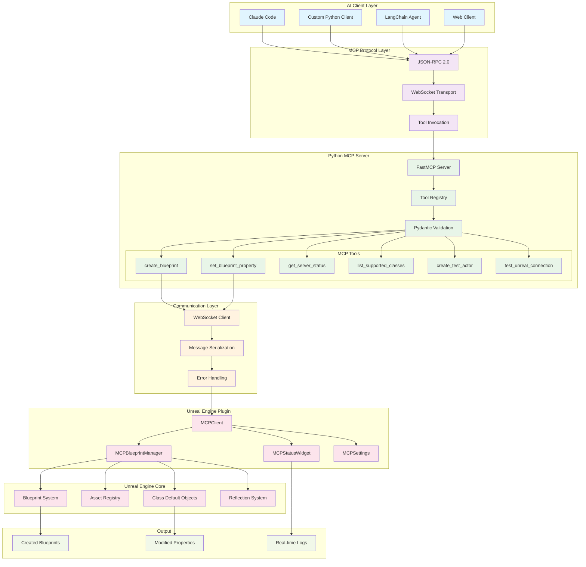
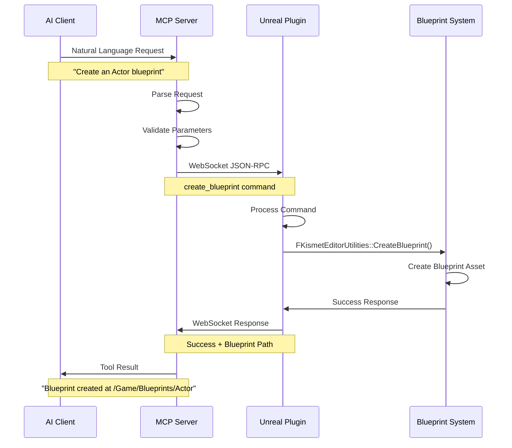
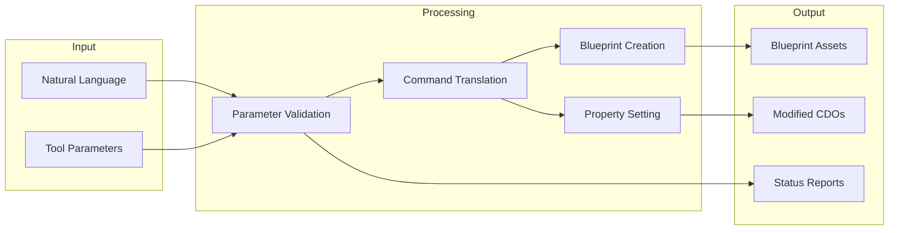
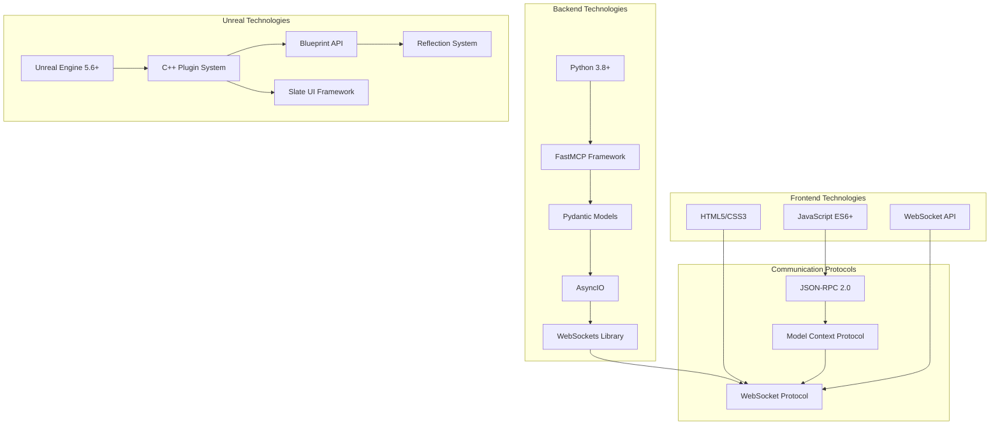

# System Architecture Diagram

```mermaid
graph TB
    subgraph "AI Client Layer"
        A1[Claude Code]
        A2[Custom Python Client]
        A3[LangChain Agent]
        A4[Web Client]
    end

    subgraph "MCP Protocol Layer"
        B1[JSON-RPC 2.0]
        B2[WebSocket Transport]
        B3[Tool Invocation]
    end

    subgraph "Python MCP Server"
        C1[FastMCP Server]
        C2[Tool Registry]
        C3[Pydantic Validation]

        subgraph "MCP Tools"
            D1[create_blueprint]
            D2[set_blueprint_property]
            D3[get_server_status]
            D4[list_supported_classes]
            D5[create_test_actor]
            D6[test_unreal_connection]
        end
    end

    subgraph "Communication Layer"
        E1[WebSocket Client]
        E2[Message Serialization]
        E3[Error Handling]
    end

    subgraph "Unreal Engine Plugin"
        F1[MCPClient]
        F2[MCPBlueprintManager]
        F3[MCPStatusWidget]
        F4[MCPSettings]
    end

    subgraph "Unreal Engine Core"
        G1[Blueprint System]
        G2[Asset Registry]
        G3[Class Default Objects]
        G4[Reflection System]
    end

    subgraph "Output"
        H1[Created Blueprints]
        H2[Modified Properties]
        H3[Real-time Logs]
    end

    %% Connections
    A1 --> B1
    A2 --> B1
    A3 --> B1
    A4 --> B1

    B1 --> B2
    B2 --> B3
    B3 --> C1

    C1 --> C2
    C2 --> C3
    C3 --> D1
    C3 --> D2
    C3 --> D3
    C3 --> D4
    C3 --> D5
    C3 --> D6

    D1 --> E1
    D2 --> E1
    E1 --> E2
    E2 --> E3

    E3 --> F1
    F1 --> F2
    F1 --> F3
    F1 --> F4

    F2 --> G1
    F2 --> G2
    F2 --> G3
    F2 --> G4

    G1 --> H1
    G3 --> H2
    F3 --> H3

    %% Styling
    classDef aiClient fill:#e1f5fe
    classDef mcpLayer fill:#f3e5f5
    classDef serverLayer fill:#e8f5e8
    classDef commLayer fill:#fff3e0
    classDef unrealLayer fill:#fce4ec
    classDef outputLayer fill:#f1f8e9

    class A1,A2,A3,A4 aiClient
    class B1,B2,B3 mcpLayer
    class C1,C2,C3,D1,D2,D3,D4,D5,D6 serverLayer
    class E1,E2,E3 commLayer
    class F1,F2,F3,F4,G1,G2,G3,G4 unrealLayer
    class H1,H2,H3 outputLayer
```

## Communication Flow

```mermaid
sequenceDiagram
    participant AI as AI Client
    participant MCP as MCP Server
    participant UE as Unreal Plugin
    participant BP as Blueprint System

    AI->>MCP: Natural Language Request
    Note over AI,MCP: "Create an Actor blueprint"

    MCP->>MCP: Parse Request
    MCP->>MCP: Validate Parameters

    MCP->>UE: WebSocket JSON-RPC
    Note over MCP,UE: create_blueprint command

    UE->>UE: Process Command
    UE->>BP: FKismetEditorUtilities::CreateBlueprint()

    BP->>BP: Create Blueprint Asset
    BP->>UE: Success Response

    UE->>MCP: WebSocket Response
    Note over UE,MCP: Success + Blueprint Path

    MCP->>AI: Tool Result
    Note over MCP,AI: "Blueprint created at /Game/Blueprints/Actor"
```

## Data Flow

```mermaid
flowchart LR
    subgraph Input
        I1[Natural Language]
        I2[Tool Parameters]
    end

    subgraph Processing
        P1[Parameter Validation]
        P2[Command Translation]
        P3[Blueprint Creation]
        P4[Property Setting]
    end

    subgraph Output
        O1[Blueprint Assets]
        O2[Modified CDOs]
        O3[Status Reports]
    end

    I1 --> P1
    I2 --> P1
    P1 --> P2
    P2 --> P3
    P2 --> P4
    P3 --> O1
    P4 --> O2
    P1 --> O3
```

## Technology Stack

```mermaid
graph TB
    subgraph "Frontend Technologies"
        FE1[HTML5/CSS3]
        FE2[JavaScript ES6+]
        FE3[WebSocket API]
    end

    subgraph "Backend Technologies"
        BE1[Python 3.8+]
        BE2[FastMCP Framework]
        BE3[Pydantic Models]
        BE4[AsyncIO]
        BE5[WebSockets Library]
    end

    subgraph "Unreal Technologies"
        UE1[Unreal Engine 5.6+]
        UE2[C++ Plugin System]
        UE3[Blueprint API]
        UE4[Slate UI Framework]
        UE5[Reflection System]
    end

    subgraph "Communication Protocols"
        CP1[JSON-RPC 2.0]
        CP2[Model Context Protocol]
        CP3[WebSocket Protocol]
    end

    FE1 --> CP3
    FE2 --> CP1
    FE3 --> CP3

    BE1 --> BE2
    BE2 --> BE3
    BE3 --> BE4
    BE4 --> BE5
    BE5 --> CP3

    UE1 --> UE2
    UE2 --> UE3
    UE2 --> UE4
    UE3 --> UE5

    CP1 --> CP2
    CP2 --> CP3
```